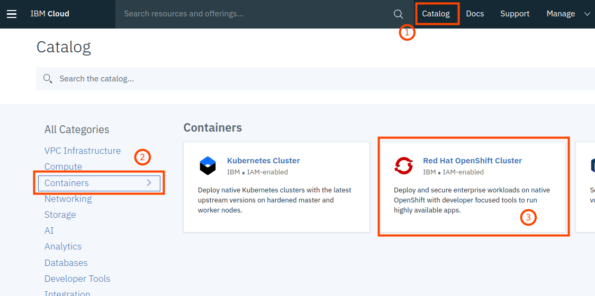
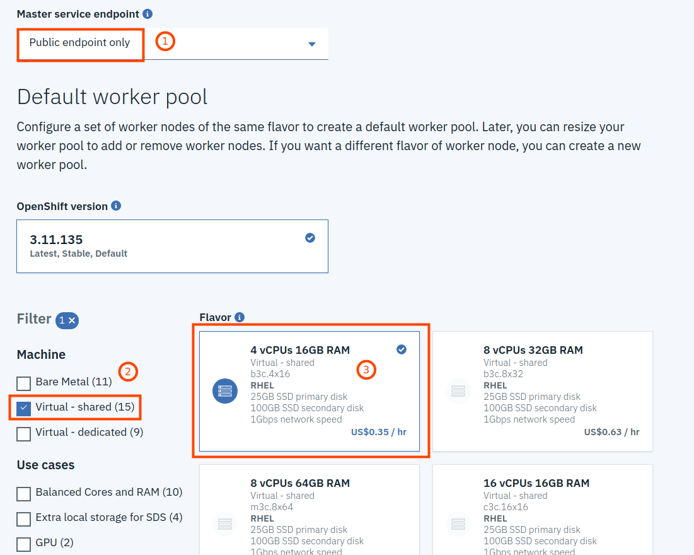

[See this in English](./Part2.md)

## Part 2: OpenShiftクラスターをIBM Cloudの上に作成する

IBM Cloud上に自分のOpenShiftクラスターを作成するには、次の手順に従います。 

__Note:__ こちらは無料のIBM Cloud Liteアカウントでは利用できません！

1. [IBM Cloud](https://cloud.ibm.com) へログインし、カタログへ移動、"コンテナー"カテゴリから、"Red Hat OpenShift Cluster"を選択します。

2. 次のダイアログで「作成」をクリックするだけです

3. 次の項目を入力します：
   * クラスター名 (1)
   * リージョン (2) ※North America、Europe、Asia Pacificが選択できます
   * ゾーン (3) *本ワークショップではシングルゾーンで十分です
   * 選択したデータセンター (4)

4. 次の通り項目を入力します：
    * マスター・サービス・エンドポイント　*"パブリック・エンドポイントのみ" (1)
    * マシン　※仮想 - 共有 (2)
    * フレーバー　*最小 (3)

   

5. 完成:
   * ノード数を本ワークショップで必要十分な1へ減らします。 (1)
   * "Create Cluster" のステータスを確認します (2)

  

クラスターの作成には少なくとも20分かかります。__この間、このワークショップのパート3で実践的な演習を行います。__

__次のワークショップ [Part 3: Red Hat tutorials](./Part3-ja.md#part-3-red-hat-tutorials) へ進む__
