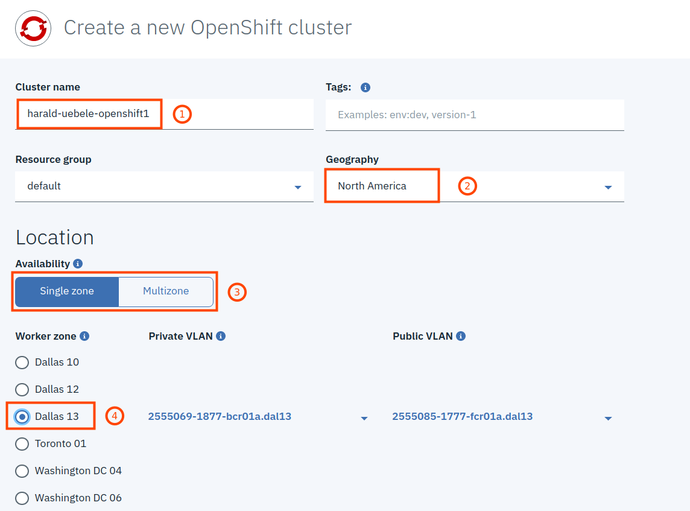

[日本語はこちら - Japanese version](./Part2-ja.md)

## Part 2: Create an OpenShift cluster on the IBM Cloud

To create your own OpenShift Cluster on IBM Cloud follow these steps. 

__Note:__ This is not available with a free IBM Cloud Lite Account!

1. Log on to the [IBM Cloud](https://cloud.ibm.com), go to the Catalog, open the category "Containers" and select "Red Hat OpenShift Cluster"

2. In the next dialog simply click "Create"

3. Fill out the form with
   * a Cluster name (1)
   * a Geography or region (2) like North America, Europe, or Asia Pacific
   * Single zone is perfect for this workshop (3)
   * a datacenter of your choice (4)

4. Continue with the form:
    * "Public endpoint only" will do (1)
    * Machine type: Virtual - shared (2)
    * and the smallest flavor (3)

   

5. Finish:
   * Reduce the number of nodes to 1 (1) which is sufficient for this workshop
   * Click "Create Cluster" (2)

  

The creation of the cluster takes at least 20 minutes, __during this time continue with Part 3 of this workshop doing some hands-on exercises.__

__Continue with [Part 3: Red Hat tutorials](https://github.com/nheidloff/openshift-on-ibm-cloud-workshops/blob/master/1-understanding-openshift/Part3.md#part-3-red-hat-tutorials)__
