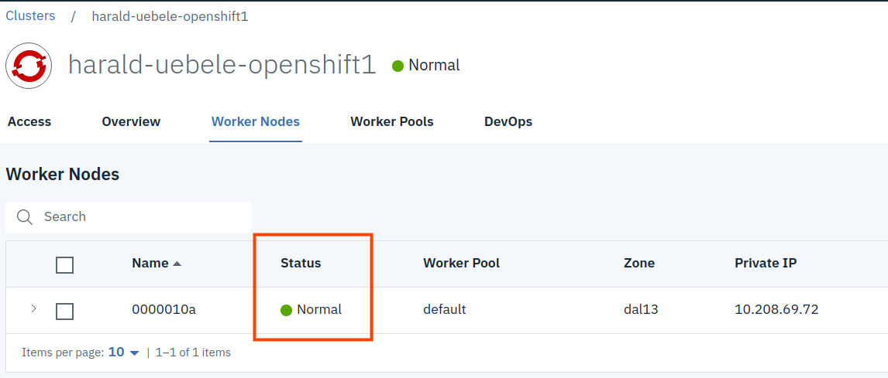
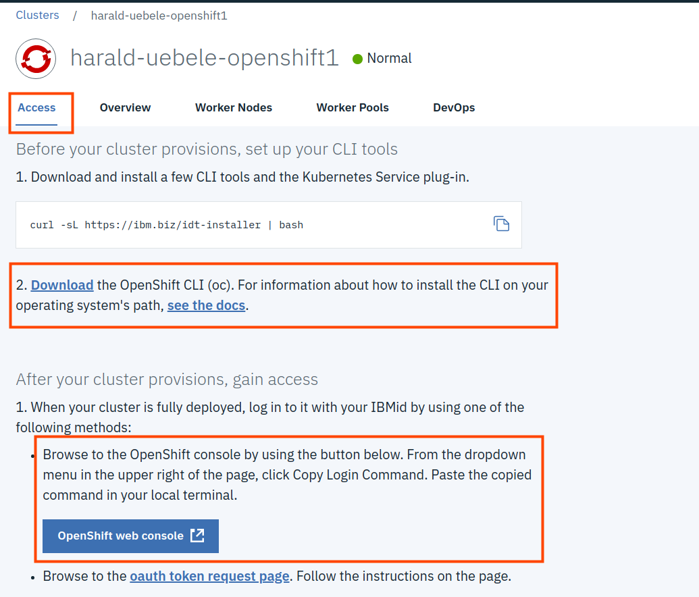

[See this in English](./Part4.md)

## Part 4: アプリケーションをIBM Cloud上のOpenShiftへデプロイする

このワークショップを完了するには、OpenShiftクラスターのセットアップを完了する必要があります。 ワーカーノードが「ワーカーノード」セクションで「正常」のステータスを表示すると、完全にセットアップされます。 __さらに__



クラスターの"Overview"に"Ingress subdomain"が表示されている場合：


このダイアログのボタン（1）からOpenShift Webコンソールにアクセスします。


パート3のインタラクティブチュートリアルでこのWebコンソールを見て使用しました。しかし、ユーザーID（1）とその右下矢印に注目してください。 クリックすると、重要なオプション"Copy Login Command"が表示されます。 これにより、 `oc`CLIを使用してIBM Cloud上のOpenShiftクラスターにログインできます。 ただし、最初にCLIをインストールする必要があります。

ワークショップのこの部分は、2つのセクションに分かれています：

  A. OpenShift Webコンソールでの作業 
  
  B. `oc`コマンドラインツールの使用


### A. Webコンソールからアプリケーションをデプロイする

1. OpenShift Webコンソールで、"+ Create Project"をクリックし、プロジェクトに名前を付けます。（例："ブログ"）その後"Create"をクリックします。

2. Click on your new project "blog" in the "My Projects" list. This opens the projects Overview, which is empty and offers you some "Get started" options.
"My Projects"リストで新しいプロジェクトの"blog"をクリックします。（先ほど"blog"と名付けた場合） これにより、プロジェクトの概要が初期状態で（空白で）開きます。いくつかの"Get started"オプションがあります。


3. "Deploy Image"をクリックします。

4. "Image Name"を選択し、名前に`openshiftkatacoda/blog-django-py`を記述、そして"虫眼鏡アイコン"をクリックします。 


5. OpenShiftは画像から詳細を読み取り、表示します。 画像名に基づいて名前を入力し、コンテンツも画像名に基づいたラベル"app"を入力します。


6. デフォルトのままにして、"Deploy"をクリックします。 表示されるダイアログで、"Continue to the project overview"リンクをクリックします。


7. プロジェクトの概要で、下向きアイコン（1）をクリックして、アプリケーションの概要を開きます。 この例はおなじみです。RedHat Learningポータルの2番目のチュートリアルで使用されました。
Create a Route（2）を選択し、デフォルトでacceptします。その後、生成されたURLをクリックすると、ブログアプリケーションが開きます。
必要に応じて、展開を拡大および縮小します（3）。


### B. Deploy an application with `oc` from the command line 

The OpenShift `oc` command line tool includes all the functionality of the Kubernetes native `kubectl` CLI but it has also all the function required for OpenShift specifics, e.g. a `login` command to access the OpenShift cluster.

### Install the OpenShift `oc` CLI

Go back to the IBM Cloud Dashboard and display your OpenShift cluster. If you closed the IBM Cloud Dashboard you can find OpenShift clusters [here](https://cloud.ibm.com/kubernetes/clusters?platformType=openshift).

In the "Access" section of your cluster is detailed information about installing the `oc`CLI and and the different methods to get access to your cluster.



### Login to the OpenShift Cluster

Once `oc` is installed, copy the login command from the OpenShift Web Console and paste it into a command window (shell). It will look similar to this:

```
$ oc login https://c100-e.us-south.containers.cloud.ibm.com:30*** --token=z5cuqxABC-9QdqE1ivXYZ1z_Y6Tghj1qxN-abCWc1Bg
```

If login is successfull you will see all the projects on OpenShift that you have access to. 

Keep the command line open but go back to the OpenShift Web Console.

### Working with the `oc` CLI


1. Go back to your command line where you used `oc`to logon to your OpenShift cluster.

2. Switch to the project you created in the Web Console with:

```
$ oc project blog

Now using project "blog" on server "https://c100-e.us-south.containers.cloud.ibm.com:30***".
```

3. Display all objects that belong to your project:

```
$ oc get all -o name

pod/blog-django-py-1-qk7d9
replicationcontroller/blog-django-py-1
service/blog-django-py
deploymentconfig.apps.openshift.io/blog-django-py
imagestream.image.openshift.io/blog-django-py
route.route.openshift.io/blog-django-py
```

4. Display all objects that are labeled with your app name, the list should be the same as before:

```
$ oc get all -l app=blog-django-py -o name

pod/blog-django-py-1-qk7d9
replicationcontroller/blog-django-py-1
service/blog-django-py
deploymentconfig.apps.openshift.io/blog-django-py
imagestream.image.openshift.io/blog-django-py
route.route.openshift.io/blog-django-py
```

5. Delete them with:

```
$ oc delete all -l app=blog-django-py -o name

pod/blog-django-py-1-qk7d9
replicationcontroller/blog-django-py-1
service/blog-django-py
deploymentconfig.apps.openshift.io/blog-django-py
imagestream.image.openshift.io/blog-django-py
route.route.openshift.io/blog-django-py
```

   If you go back to the Web Console you should see that it updated the Overview which now should be empty again.

### Deploy an application from the command line

1. Check if the image is available:

```
$ oc new-app --search openshiftkatacoda/blog-django-py

Docker images (oc new-app --docker-image=<docker-image> [--code=<source>])
-----
openshiftkatacoda/blog-django-py
  Registry: Docker Hub
  Tags:     latest

```

2. Deploy the image as an application:

```
$ oc new-app openshiftkatacoda/blog-django-py

--> Found Docker image 927f823 (2 months old) from Docker Hub for "openshiftkatacoda/blog-django-py"

    Python 3.5 
    ---------- 
    Python 3.5 available as container is a base platform for building and running various Python 3.5 applications and frameworks. Python is an easy to learn, powerful programming language. It has efficient high-level data structures and a simple but effective approach to object-oriented programming. Python's elegant syntax and dynamic typing, together with its interpreted nature, make it an ideal language for scripting and rapid application development in many areas on most platforms.

    Tags: builder, python, python35, python-35, rh-python35

    * An image stream tag will be created as "blog-django-py:latest" that will track this image
    * This image will be deployed in deployment config "blog-django-py"
    * Port 8080/tcp will be load balanced by service "blog-django-py"
      * Other containers can access this service through the hostname "blog-django-py"

--> Creating resources ...
    imagestream.image.openshift.io "blog-django-py" created
    deploymentconfig.apps.openshift.io "blog-django-py" created
    service "blog-django-py" created
--> Success
    Application is not exposed. You can expose services to the outside world by executing one or more of the commands below:
     'oc expose svc/blog-django-py' 
    Run 'oc status' to view your app.
```

3. Check the status of your deployment:

```
$ oc status --suggest

In project blog on server https://c100-e.us-south.containers.cloud.ibm.com:30634

svc/blog-django-py - 172.21.51.187:8080
  dc/blog-django-py deploys istag/blog-django-py:latest 
    deployment #1 deployed 56 seconds ago - 1 pod

Info:
  * dc/blog-django-py has no readiness probe to verify pods are ready to accept traffic or ensure deployment is successful.
    try: oc set probe dc/blog-django-py --readiness ...
  * dc/blog-django-py has no liveness probe to verify pods are still running.
    try: oc set probe dc/blog-django-py --liveness ...

```

The --suggest options even gives you infos on things that are missing in your configuration.

4. Your application needs a Route to expose it externally:

```
$ oc expose service/blog-django-py

route.route.openshift.io/blog-django-py exposed
```

5. Display the URL of the Route:

```
$ oc get route/blog-django-py

NAME             HOST/PORT                                                                                                               PATH      SERVICES         PORT       TERMINATION   WILDCARD
blog-django-py   blog-django-py-blog.harald-uebele-openshift-5290c8c8e5797924dc1ad5d1bcdb37c0-0001.us-south.containers.appdomain.cloud             blog-django-py   8080-tcp                 None
```

You can see the very long URL. If you want, copy it and open it in your browser.

6. Cleanup. This deletes everything including your project!
   This command takes a while to complete.

```
$ oc delete project blog

project.project.openshift.io "blog" deleted
```
You can also delete a complete project from the Web Console.

---


Congratulations! You have completed this workshop!  


__Continue with the second workshop__ in this series: "[Deploying Java Microservices to OpenShift on IBM Cloud](https://github.com/nheidloff/openshift-on-ibm-cloud-workshops/tree/master/2-deploying-to-openshift#deploying-java-microservices-to-openshift-on-ibm-cloud)".


__Back to the [overview](../../../../openshift-on-ibm-cloud-workshops#openshift-on-ibm-cloud-workshops)__
