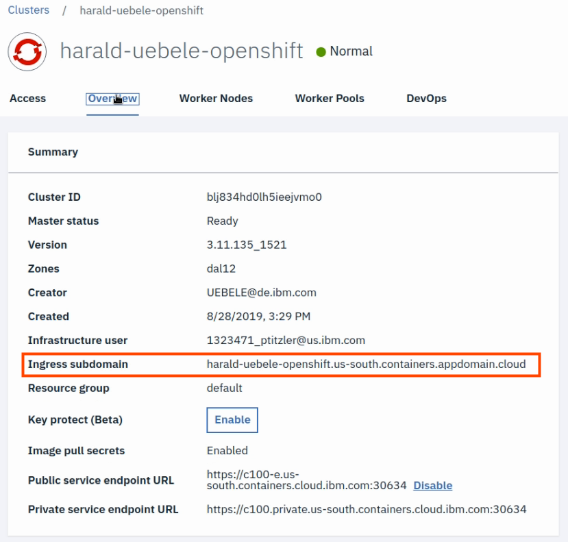

## Understanding OpenShift - For Developers

When I started to work with OpenShift, coming from plain Kubernetes, I was very surprised when I saw the OpenShift Web Console (Dashboard) for the first time. It takes a bit to get used to it but then you realize that this is not an afterthought but a very well designed tool specifically for developers. The same is true for `oc`, the OpenShift command line tool. 

In this workshop we will show you how to create your own OpenShift cluster on the IBM Cloud, and how to use the `oc`CLI and the OpenShift Web Console.

### Part 1: Introduction

Our colleague Sai Vennam, IBM Cloud Developer Advocate, has created two videos on OpenShift on the IBM Cloud that you should watch:

1. <a href="https://www.youtube.com/watch?v=hdwDMsDF9J8" target="blank">Intro to Red Hat OpenShift on IBM Cloud</a> (Duration: 2 mins)
   What is OpenShift? OpenShift on the IBM Cloud: a managed offering, multiple deployment options, certification. Unified Hybrid Cloud platform.
2. <a href="https://www.youtube.com/watch?v=l4Vrj7mkxhQ" target="blank">Guided Tour for Red Hat OpenShift on IBM Cloud</a> (Duration: 6 mins) 
   How to create an OpenShift cluster in IBM Cloud, create an OpenShift project in the Web Console.

### Part 2: Create cluster on the IBM Cloud

To create your own OpenShift Cluster on IBM Cloud follow these steps. 

Note: This is not available with a IBM Cloud Lite Account!

1. Log on to the IBM Cloud, go to the Catalog, open section "Containers" and select "Red Hat OpenShift Cluster"

2. In the next dialog simply click "Create"

3. Fill out the form with
   * a name (1)
   * a region (2) like North America or Central Europe
   * single zone is perfect for this workshop (3)
   * a datacenter of your choice (4)

4. Continue with the form:
    * "Public endpoints" or "private & public endpoints" will do (1)
    * Machine type: Virtual - shared (2)
    * and the smallest flavor (3)

   

5. Finish:
   * Reduce the number of nodes to 2 (1)
   * Click "Create Cluster" (2)

  

The creation of the cluster takes at least 20 minutes, __during this time continue with Part 3 of this workshop doing some hands-on exercises.__

### Part 3: Red Hat tutorials 

We will use the time while you are waiting for your OpenShift cluster to get ready. There is a lot of really good material at the Red Hat OpenShift [Interactive Learning Portal](https://learn.openshift.com/). You get access to a real OpenShift system during these tutorials.

1) [Getting Started with OpenShift for Developers](https://learn.openshift.com/introduction/getting-started/)
In this tutorial you will learn the fundamentals:
   * Basics of the OpenShift platform and the Learning Portal environment (Katacoda)
   * Using the `oc`CLI and the Web Console
   * What is a project? Creating a project in OpenShift
   * Deploying an app from a Docker image
   * Scaling an app, self-healing
   * What is a Route, creating a Route
   * Using Source-to-Image to create an app

2) [Deploying Applications From Images](https://learn.openshift.com/introduction/deploying-images/)
This tutorial is about deploying an application from an existing image (from Docker Hub) and how OpenShift creates a deployment on Kubernetes without the developer touching any YAML files. It includes:

   * Creating a Project
   * Deploy a Docker image from the Web Console
   * Create an external Route
   * Delete an application (everything) from the command line using labels
   * Deploy a Docker image from the command line
   * Import an application image, work with image streams

3) [Deploying Applications From Source](https://learn.openshift.com/introduction/deploying-python/)
This tutorial uses a code repository on Github that holds a Python application. The Source-to-Image builder uses a Python template to create a Container image within OpenShift and deploys it, again without the developer touching any YAML files. Another method, binary build, creates the image from code on the developers workstation. These are the topics of this tutorial:  
   * Create a Project
   * Source-to-Image (S2I) of a Python project in Github
   * Builder Logs
   * Accessing the application
   * Deleting the application via CLI
   * S2I via `oc`command line, differences to Web Console
   * Triggering a new build
   * Binary build from a local code repository

### Part 4: Deploy an application on OpenShift on the IBM Cloud

The setup of the OpenShift cluster must be complete to finish this workshop. It is completely set up when the worker nodes show a status of "Normal" in the "Worker Nodes" section __AND__

there is a "Ingress subdomain" in the "Overview" of the cluster:

Access the OpenShift Web Console via the button in this dialog. 

