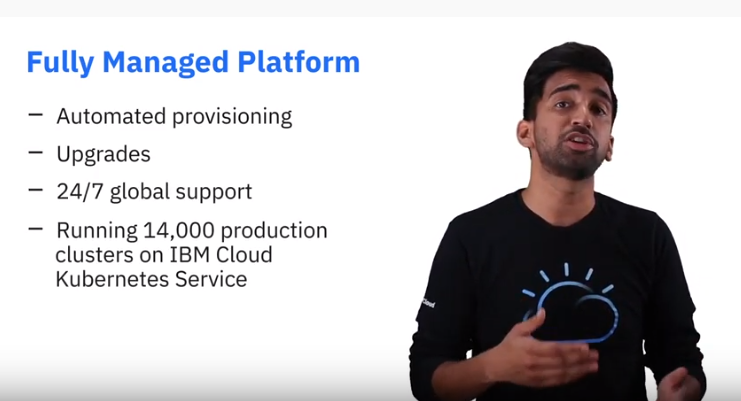
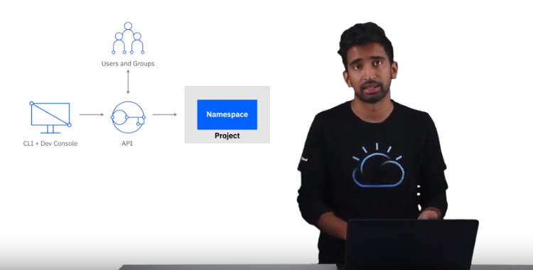

[日本語はこちら - Japanese version](./README-ja.md)

# Understanding OpenShift

If you have only worked with "plain" Kubernetes you will be very surprised when you see the OpenShift Web Console (Dashboard) for the first time. It takes a bit to get used to it but then you realize that this is not an afterthought but a very well designed tool specifically for developers and for administrators, too. The same is true for `oc`, the OpenShift command line tool. It includes all the functions of the `kubectl` CLI and adds the special capabilities of OpenShift.  

In this workshop we will show you how to create your own OpenShift cluster on the IBM Cloud, and how to use the `oc` CLI and the OpenShift Web Console.

__Note:__ An [IBM Cloud account](https://cloud.ibm.com/registration) is needed for this workshop. A free IBM Cloud Lite account is not sufficient.

## Part 1: Introduction

Our colleague Sai Vennam, IBM Cloud Developer Advocate, has created two videos about OpenShift on the IBM Cloud that you should watch:

1. <a href="https://www.youtube.com/watch?v=hdwDMsDF9J8" target="blank">Intro to Red Hat OpenShift on IBM Cloud</a> (Duration: 2 mins)

   What is OpenShift? OpenShift on the IBM Cloud is a fully managed offering, with multiple deployment options, and certification. It is a Unified Hybrid Cloud platform.

2. <a href="https://www.youtube.com/watch?v=l4Vrj7mkxhQ" target="blank">Guided Tour for Red Hat OpenShift on IBM Cloud</a> (Duration: 6 mins) 

   How to create an OpenShift cluster in IBM Cloud, how to create a project in the OpenShift Web Console.

__Continue the Workshop here:__

[Part 2: Create an OpenShift cluster on the IBM Cloud](https://github.com/nheidloff/openshift-on-ibm-cloud-workshops/blob/master/1-understanding-openshift/Part2.md#part-2-create-an-openshift-cluster-on-the-ibm-cloud)

[Part 3: Red Hat tutorials](https://github.com/nheidloff/openshift-on-ibm-cloud-workshops/blob/master/1-understanding-openshift/Part3.md#part-3-red-hat-tutorials)

[Part 4: Deploy an application on OpenShift on the IBM Cloud](https://github.com/nheidloff/openshift-on-ibm-cloud-workshops/blob/master/1-understanding-openshift/Part4.md#part-4-deploy-an-application-on-openshift-on-the-ibm-cloud)

__Continue with the second workshop__ in this series: "[Deploying Java Microservices to OpenShift on IBM Cloud](https://github.com/nheidloff/openshift-on-ibm-cloud-workshops/tree/master/2-deploying-to-openshift#deploying-java-microservices-to-openshift-on-ibm-cloud)".

