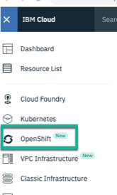
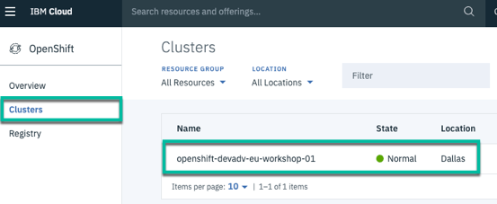
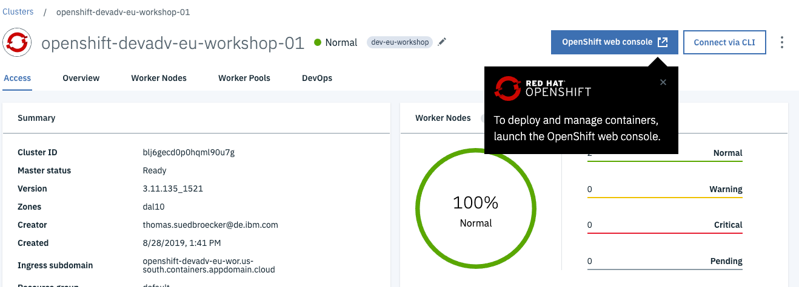
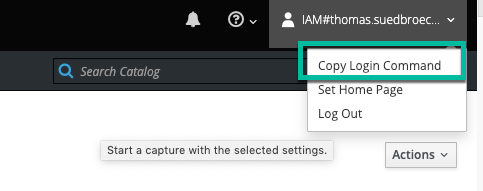

## Access to the IBM Cloud

> Installing prerequisites: [video (2:58 mins)](https://youtu.be/c5CtqijWXL4) and [video including windows (4:11 mins)](https://youtu.be/53XccO3NNn8)

## Overview 

An [IBM Cloud account](https://cloud.ibm.com/registration) is needed. 

Note: In order to run this workshop an IBM Cloud Lite account is not sufficient. This tutorial may incur costs. Use the [Pricing Calculator](https://cloud.ibm.com/estimator/review) to generate a cost estimate based on your projected usage.

We will use the [OpenShift on IBM Cloud](https://cloud.ibm.com/kubernetes/catalog/openshiftcluster) service on IBM Cloud in this hands-on workshop.


Follow the [instructions](../../1-understanding-openshift#part-2-create-cluster-on-the-ibm-cloud) from the first workshop to set up an OpenShift cluster.

## Tools

In order to complete the workshop, you need to install [Docker Desktop](https://docs.docker.com/install/). Docker Desktop is available for Mac and Windows and the Docker Engine can be run natively on Linux.

Several other tools are needed. There are different options to install these tools.

>In the **Java developer labs** 2 and 3 you need a local docker installation and therefore you will be guided later to create an additional local terminal session. 

> The following tool options are only relevant from lab 4 on when we are going to use the OpenShift **oc** and the **ibmcloud** CLI to deploy the microservice to OpenShift.

---

### Tools - Option 1 (prefered for Mac and Linux): Prebuilt Image with local Code

There is an image on DockerHub with all required tools. In order to use local IDEs and editors to modify code and configuraton files a Docker volume is used. This option  works only for Mac and Linux.

#### Step 1: Run these commands in a terminal

```
$ git clone https://github.com/IBM/openshift-on-ibm-cloud-workshops.git
$ cd openshift-on-ibm-cloud-workshops
$ ROOT_FOLDER=$(pwd)
$ docker run -v $ROOT_FOLDER/:/cloud-native-starter -it --rm nheidloff/openshift-workshop-tools:v1
```

#### Step 2: Inside your running Docker image you can access your the local project 

You should see the prompt like this `root@3f46c41f7303:/usr/local/bin#`, now run the following instructions:

```
$ cd /cloud-native-starter/
$ ls
$ ROOT_FOLDER=$(pwd)
```

_Note:_ With the `--rm` option in the docker run command the container is deleted once you exit. This is intended.

#### Step 3: Move on with [Verify Access to OpenShift on the IBM Cloud](./1-prereqs.md#verify-access-to-openshift-on-the-ibm-cloud)


### Tools - Option 2 (prefered for Windows): Prebuilt Image with Code in Container

There is an image on DockerHub with all required tools. This option works for Mac, Linux and Windows. To get started as quickly as possible, use this image.

#### Step 1: Run this command in a terminal

```
$ docker run -ti nheidloff/openshift-workshop-tools:v1
```

#### Step 2: After the container has been started, run these commands inside your running Docker image to get the lastest version of the workshop:

You should see the prompt like this `root@3f46c41f7303:/usr/local/bin#`, now run the following instructions:

```
$ cd /
$ git clone https://github.com/IBM/openshift-on-ibm-cloud-workshops.git
$ cd openshift-on-ibm-cloud-workshops
$ ROOT_FOLDER=$(pwd)
```

_Note:_ If you using Windows you also need to **download or clone the project to your local workstation** for the upcoming Docker and Java lab, because you can't use Docker in the 'openshift-workshop-tools' Docker image.

#### Step 3: Move on with [Verify Access to OpenShift on the IBM Cloud](./1-prereqs.md#verify-access-to-openshift-on-the-ibm-cloud)


### Tools - Option 3: Install Tools on your Notebook

This approach works only for Mac and Linux (see this [article](https://suedbroecker.net/2019/08/27/definition-of-a-dockerfile-to-use-bash-scripts-on-a-windows-10-machine-for-our-cloud-native-starter-workshop/) for more).

#### Step 1: Install the following tools:

- [oc](https://cloud.ibm.com/docs/containers?topic=containers-cs_cli_install#cli_oc)
- [kubectl](https://kubernetes.io/docs/tasks/tools/install-kubectl/)
- [git](https://git-scm.com/book/en/v2/Getting-Started-Installing-Git) 
- [curl](https://curl.haxx.se/download.html)
- Optional: [IBM Cloud CLI](https://cloud.ibm.com/docs/home/tools)
- Optional: Editor, for example [Visual Studio Code](https://code.visualstudio.com/) 

#### Step 2: Get the code:

```
$ git clone https://github.com/IBM/openshift-on-ibm-cloud-workshops.git
$ cd openshift-on-ibm-cloud-workshops
$ ROOT_FOLDER=$(pwd)
```

#### Step 3: Move on with [Verify Access to OpenShift on the IBM Cloud](./1-prereqs.md#verify-access-to-openshift-on-the-ibm-cloud)

---

## Verify Access to OpenShift on the IBM Cloud

### Step 1: After you've created a new cluster, open the OpenShift console. 

1. Logon to the IBM Cloud web console

2. Select **OpenShift** in the menu



3. Chose **Clusters** and click on your **OpenShift cluster**



4. Open the **OpenShift web console**



### Step 2: Get our access token for the 'oc' CLI. 


1. From the dropdown menu in the upper right of the page, click 'Copy Login Command'. Paste the copied command into your terminal.



2. Verify 'oc' CLI

```
$ oc login https://c1-e.us-east.containers.cloud.ibm.com:23967 --token=xxxxxx'
$ oc projects
```

3. Verify 'kubectl' CLI

```
$ kubectl get pods
```
---

:star: __Continue with [Lab 2 - Running the Java Microservice locally](./2-docker.md#lab-2---running-the-java-microservice-locally)__ 

---

_Note:_ You can jump back to lab 4 '1. Build and Save the container image' in ['Step 1'](./4-openshift.md#step-1-create-an-open-shift-project), if you want.

