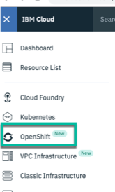
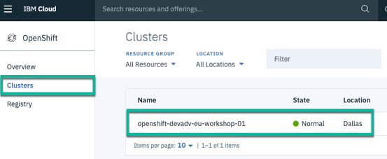

# Lab 4 - Deploying to OpenShift


We will work in the **OpenShift web console** and in the **OpenShift CLI**.

# 1. Build and save the container

## Step 1: Create a Open Shift project

To work inside OpenShift we need a OpenShift project.
Let us create one.

```
$ cd ${ROOT_FOLDER}/2-deploying-to-openshift
$ oc new-project cloud-native-starter
```

**Ensure** you are logged on to your **Open Shift** cluster.
[See details](https://github.com/nheidloff/openshift-on-ibm-cloud-workshops/blob/master/2-deploying-to-openshift/documentation/1-prereqs.md#verify-access-to-openshift-on-the-ibm-cloud)

## Step 2: Build and save the container the Open Shift registry

Now we want to build and save the container in the **Open Shift registry**.
We use these command to do that:

1. Build the binary of the Docker image 

```
$ oc new-build --name authors --binary --strategy docker
```

2. Upload the binary of the Docker image

```
$ oc start-build authors --from-dir=.
```

## Step 3: Verify the container image in the Open Shift registry UI

1. Logon to IBM Cloud web console

2. Select **Open Shift** in the menu



3. Chose **Clusters** and click on your **OpenShift cluster**



4. Open the **OpenShift web console**


5. Select in **My Projects** the **default** project


6. Expand in **Overview** the **DEPLOYMENT registry-console** and click **Routes - External Traffic**


7. In the container registry you will find later the **authors** image and you can click on the latest label.


8. _Optional:_ Examine the container image details


# 2. Apply the deployment.yaml

The deployment will deploy the container to a Pod in Kubernetes.
For more details we use the [Kubernetes documentation](https://kubernetes.io/docs/concepts/workloads/pods/pod-overview/) for Pods.

> A Pod is the basic building block of Kubernetes–the smallest and simplest unit in the Kubernetes object model that you create or deploy. A Pod represents processes running on your Cluster .

Let's start with the **deployment yaml**. For more details we use will the [Kubernetes documentation](https://kubernetes.io/docs/concepts/workloads/controllers/deployment/) for deployments.

Definition of the ```kind``` defines this is a ```Deployment``` configuration.

```yml
kind: Deployment
apiVersion: apps/v1beta1
metadata:
  name: authors
```

Inside the ```spec``` section, we give the deployment a app name and version label.

```yml
spec:
  ...
  template:
    metadata:
      labels:
        app: authors
        version: v1
```

Then we define a ```name``` for the container and we provide the concret container ```image``` location, e.g. where the container can be found in the **Container Registry**. 

The ```containerPort``` depends on the port definition inside our **Dockerfile** or better in our **server.xml**.

Now we should remember the usage of **HealthEndpoint** class for our **Authors**, here we see the ```livenessProbe``` definition.


```yml
spec:
      containers:
      - name: authors
        image: authors:1
        ports:
        - containerPort: 3000
        livenessProbe:
```

This is the full [deployment.yaml](../deployment/deployment-os.yaml) file.

```yaml
kind: Deployment
apiVersion: apps/v1beta1
metadata:
  name: authors
spec:
  replicas: 1
  template:
    metadata:
      labels:
        app: authors
        version: v1
    spec:
      containers:
      - name: authors
        image: authors:1
        ports:
        - containerPort: 3000
        livenessProbe:
          exec:
            command: ["sh", "-c", "curl -s http://localhost:3000/"]
          initialDelaySeconds: 20
        readinessProbe:
          exec:
            command: ["sh", "-c", "curl -s http://localhost:3000/health | grep -q authors"]
          initialDelaySeconds: 40
      restartPolicy: Always
```

## Step 1: Apply the deployment

1. Ensure you are in the ```{ROOT_FOLDER}/deploying-to-openshift/deployment```

```
$ cd ${ROOT_FOLDER}/deploying-to-openshift/deployment
```

2. Apply the deployment to **OpenShift**

```
$ oc apply -f deployment.yaml
```

## Step 2: Verify the deployment in **OpenShift**

1. Logon to **IBM Cloud web console** and open your **OpenShift web console**

2. Select the **Cloud-Native-Starter** project and examine the deployment


# 3. Apply the service.yaml

After the definition of the **Pod** we need to define how to access the Pod, therefor we use a **service** in Kubernetes. For more details we use the [Kubernetes documentation](https://kubernetes.io/docs/concepts/services-networking/service/) for service.

> A Kubernetes Service is an abstraction which defines a logical set of Pods and a policy by which to access them - sometimes called a micro-service. The set of Pods targeted by a Service is (usually) determined by a Label Selector.

In the service we map the **NodePort** of the cluster to the port 3000 of the **Authors** service running in the **authors** Pod, as we can see in the following picture. 


In the [service.yaml](../deployment/service-os.yaml) we find our selector to the Pod **authors**. If the service is deployed, it is possible that our **Articles** service can find the **Authors** service.

```yaml
kind: Service
apiVersion: v1
metadata:
  name: authors
  labels:
    app: authors
spec:
  selector:
    app: authors
  ports:
    - port: 3000
      name: http
  type: NodePort
---
```


```
$ oc apply -f service.yaml
$ oc expose svc/authors
$ open http://$(oc get route authors -o jsonpath={.spec.host})/openapi/ui/
$ curl -X GET "http://$(oc get route authors -o jsonpath={.spec.host})/api/v1/getauthor?name=Niklas%20Heidloff" -H "accept: application/json"
```

