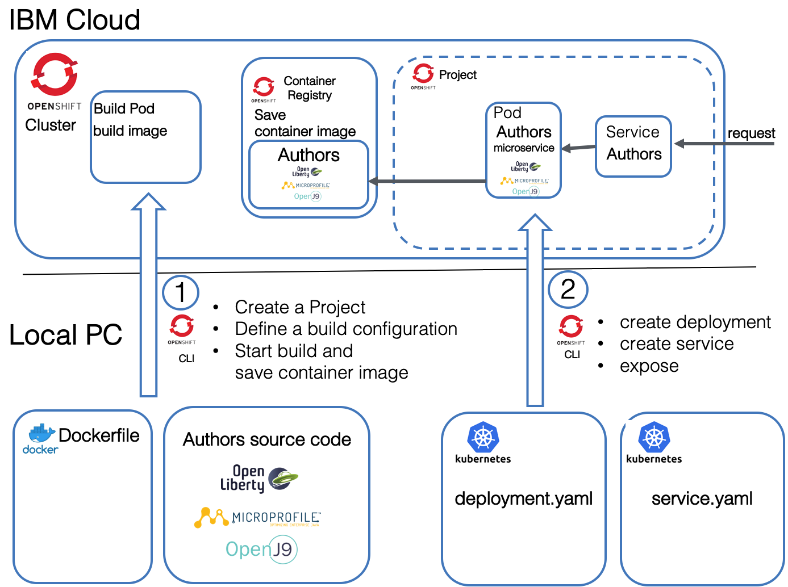
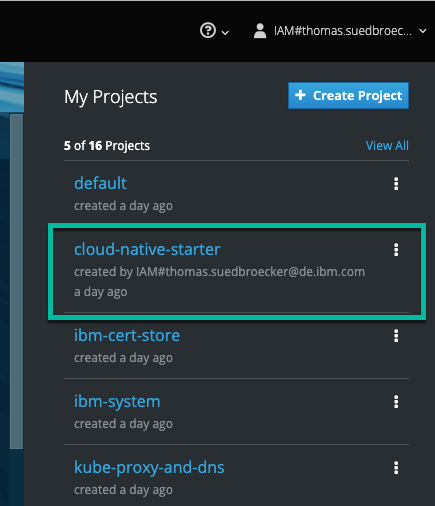

# Lab 4 - Deploying to OpenShift

In this lab we will work in the OpenShift Web Console and with the OpenShift CLI. The following image is a simplified overview of the topics of that lab. Have in mind that [OpenShift](https://www.youtube.com/watch?v=5dwMrFxq8sU&feature=youtu.be) is a [Kubernetes](https://www.youtube.com/watch?v=4ht22ReBjno) platform.



This lab has two parts: 

1. Build and save the container image

  * We will create a OpenShift project
  * We will define a [build config](https://docs.openshift.com/container-platform/3.9/dev_guide/builds/index.html) for OpenShift
  * We will build with the build Pod inside OpenShift and save container image to the internal [OpenShift container registry](https://docs.openshift.com/container-platform/3.9/install_config/registry/index.html#install-config-registry-overview)

2. Deploy the application and expose the service

  * We will define and apply a deployment configuration (yaml) to create a Pod with our microservice
  * We will define a service which routes requests to the Pod with our microservice
  * We will expose the service

The following gif is an animation of the simplified steps above in a sequence.


# 1. Build and save the container image

## Step 1: Create an Open Shift project

We need an OpenShift project, this is simply put equivalent to a Kubernetes namespace plus OpenShift security. Let us create one.

_Note:_ A [project allows](https://docs.openshift.com/container-platform/3.7/dev_guide/projects.html#overview) a community of users to organize and manage their content in isolation from other communities.

```
$ cd ${ROOT_FOLDER}/2-deploying-to-openshift
$ oc new-project cloud-native-starter
```

**Make sure** you are logged on to your OpenShift cluster.
[See here.](https://github.com/nheidloff/openshift-on-ibm-cloud-workshops/blob/master/2-deploying-to-openshift/documentation/1-prereqs.md#verify-access-to-openshift-on-the-ibm-cloud)

## Step 2: Build and save the container image in the Open Shift Container Registry

Now we want to build and save a container image in the OpenShift Container Registry. 
We use these commands to do that:

1. Defining a new build using 'binary build' and the Docker strategy ([more details](https://docs.openshift.com/container-platform/3.5/dev_guide/builds/build_inputs.html#binary-source) and [oc new-build documentation](https://docs.openshift.com/container-platform/3.9/cli_reference/basic_cli_operations.html#new-build))

```
$ oc new-build --name authors --binary --strategy docker
```

2. Starting the build process on OpenShift with our defined build configuration. ([oc start-build documentation](https://docs.openshift.com/container-platform/3.9/cli_reference/basic_cli_operations.html#start-build))

```
$ oc start-build authors --from-dir=.
```

## Step 3: Verify the build in the OpenShift web console


1. Select the 'cloud-native-starter' project in 'My Projects'

  

2. Open 'Builds' in the menu and then click 'Builds'

  

3. Select 'Last Build' (#1) 

  

4. Open 'Logs' 

  

5. Inspect the logs 

  

## Step 4: Verify the container image in the Open Shift Container Registry UI

1. Select the 'default' project

2. Expand DEPLOYMENT 'registry-console' in 'Overview' and click on the URL in 'Routes - External Traffic'

  

3. In the container registry you will find the 'authors' image and you can click on the latest label.

  

# 2. Apply the deployment.yaml

This deployment will deploy a container to a Pod in Kubernetes.
For more details we use the [Kubernetes documentation](https://kubernetes.io/docs/concepts/workloads/pods/pod-overview/) for Pods.

> A Pod is the basic building block of Kubernetes–the smallest and simplest unit in the Kubernetes object model that you create or deploy. A Pod represents processes running on your Cluster .

Here is a simplified image for that topic. The deployment.yaml file points to the container image that needs to be instantiated in the pod.


Let's start with the deployment yaml. For more details see the [Kubernetes documentation](https://kubernetes.io/docs/concepts/workloads/controllers/deployment/) for deployments.

Definition of `kind` defines this as a `Deployment` configuration.

```yml
kind: Deployment
apiVersion: apps/v1beta1
metadata:
  name: authors
```

Inside the `spec` section we specify an app name and version label.

```yml
spec:
  ...
  template:
    metadata:
      labels:
        app: authors
        version: v1
```

Then we define a `name` for the container and we provide the container `image` location, e.g. where the container can be found in the **Container Registry**. 

The `containerPort` depends on the port definition inside our Dockerfile and in our server.xml.

We have previously talked about the usage of the HealthEndpoint class for our Authors service and here we see it the `livenessProbe` definition.


```yml
spec:
      containers:
      - name: authors
        image: authors:1
        ports:
        - containerPort: 3000
        livenessProbe:
```

This is the full [deployment.yaml](../deployment/deployment.yaml) file.

```yaml
kind: Deployment
apiVersion: apps/v1beta1
metadata:
  name: authors
spec:
  replicas: 1
  template:
    metadata:
      labels:
        app: authors
        version: v1
    spec:
      containers:
      - name: authors
        image: docker-registry.default.svc:5000/cloud-native-starter/authors:latest
        ports:
        - containerPort: 3000
        livenessProbe:
          exec:
            command: ["sh", "-c", "curl -s http://localhost:3000/"]
          initialDelaySeconds: 20
        readinessProbe:
          exec:
            command: ["sh", "-c", "curl -s http://localhost:3000/health | grep -q authors"]
          initialDelaySeconds: 40
      restartPolicy: Always
```

## Step 1: Apply the deployment

1. Ensure you are in the ```{ROOT_FOLDER}/2-deploying-to-openshift/deployment```

  ```
  $ cd ${ROOT_FOLDER}/2-deploying-to-openshift/deployment
  ```

2. Apply the deployment to **OpenShift**

  ```
  $ oc apply -f deployment.yaml
  ```

## Step 2: Verify the deployment in **OpenShift**

1. Open your OpenShift Web Console

2. Select the Cloud-Native-Starter project and examine the deployment

  

3. Click on **#1** to open the details of the deployment

  

4. In the details you find the 'health check' we defined before

  

# 3. Apply the service.yaml

After the definition of the Pod we need to define how to access the Pod. For this we use a service in Kubernetes. For more details see the [Kubernetes documentation](https://kubernetes.io/docs/concepts/services-networking/service/) for service.

> A Kubernetes Service is an abstraction which defines a logical set of Pods and a policy by which to access them - sometimes called a micro-service. The set of Pods targeted by a Service is (usually) determined by a Label Selector.

In the service we map the NodePort of the cluster to the port 3000 of the Authors microservice running in the authors Pod, as we can see in the following picture.


In the [service.yaml](../deployment/service-os.yaml) we see a selector of the pod using the label 'app: authors'. 

```yaml
kind: Service
apiVersion: v1
metadata:
  name: authors
  labels:
    app: authors
spec:
  selector:
    app: authors
  ports:
    - port: 3000
      name: http
  type: NodePort
---
```

## Step 1: Apply the service deployment

1. Apply the service to OpenShift

  ```
  $ oc apply -f service.yaml
  ```

2. Using oc [expose](https://docs.openshift.com/container-platform/3.6/dev_guide/routes.html) we create a Route to our service in the OpenShift cluster. ([oc expose documentation](https://docs.openshift.com/container-platform/3.9/cli_reference/basic_cli_operations.html#expose))

  ```
  $ oc expose svc/authors
  ```

## Step 2: Test the microservice

1. Execute this command, copy the URL to open the Swagger UI in browser

  ```
  $ echo http://$(oc get route authors -o jsonpath={.spec.host})/openapi/ui/
  $ http://authors-cloud-native-starter.openshift-devadv-eu-wor-160678-0001.us-south.containers.appdomain.cloud/openapi/ui/
  ```

This is the Swagger UI in your browser:

  

1. Execute this command to verify the output:

  ```
  $ curl -X GET "http://$(oc get route authors -o jsonpath={.spec.host})/api/v1/getauthor?name=Niklas%20Heidloff" -H "accept: application/json"
  ```

2. Output

  ```
  $ {"name":"Niklas Heidloff","twitter":"https://twitter.com/nheidloff","blog":"http://heidloff.net"}
  ```

## Step 3: Inspect the service in OpenShift

1. Open your OpenShift Web Console

2. Select the Cloud-Native-Starter project

  

3. Chose 'Applications' and then 'Services' 

  

4. Click on 'authors'

5. Examine the traffic and remember the simplified overview picture.

  

---

__Continue with [Lab 5 - Deploying existing Images from Docker Hub](./5-existing-image.md)__


