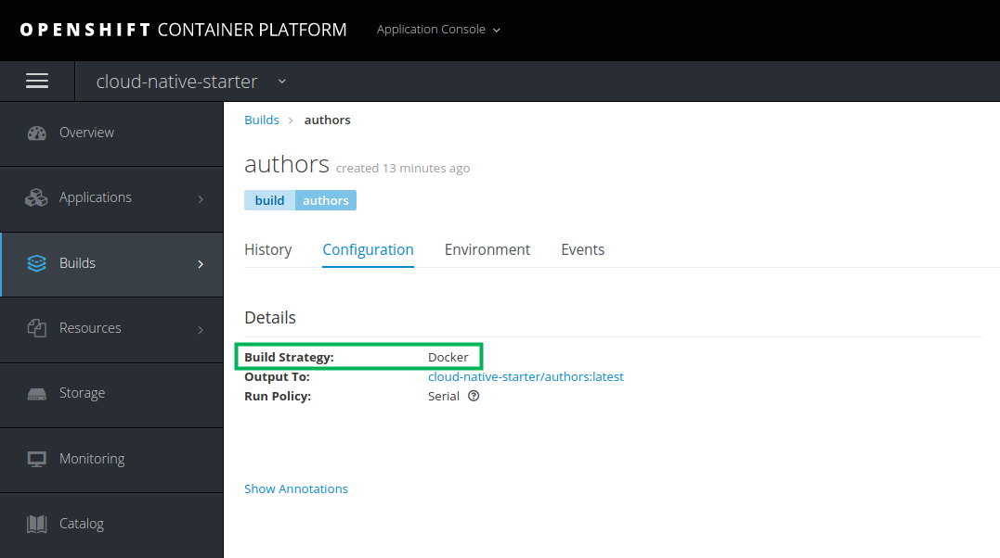
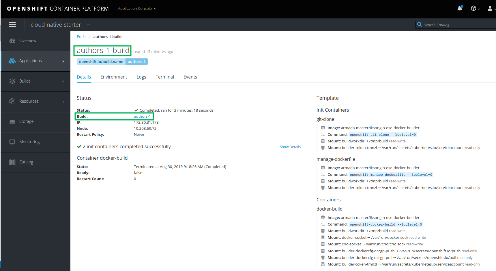
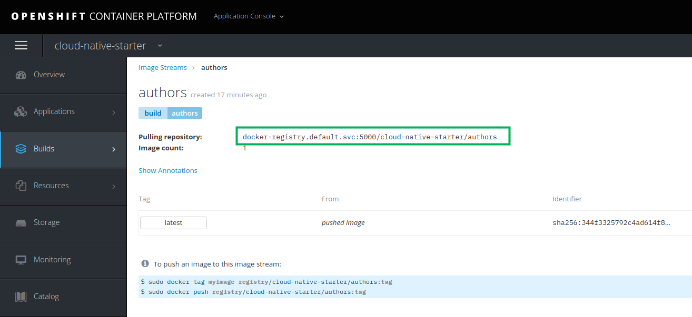

Alternative zu 
__Step 3: Verify the container image in the Open Shift Container Registry UI__

Anregung: Logon zur Web Console im Original in 0-prereqs ans Ende, da gehört es eigentlich hin

## Step 3: Verify the binary build

Now we want to see the results of the binary build (performed in the last step) look like in the OpenShift Web Console.

1. Open the OpenShift Web Console and select "cloud-native-starter" from the "My Projects" list.

2. Select the "Builds" menu on the left side and then "Builds" again. This opens the list of build configurations which currently should show one build named "authors". This is the result of the `oc new-build` command. Open "authors".
You can see the 'Build Strategy: Docker' as result of `--strategy docker` in the command. And the build will result in an image stream 'cloud-native-starter/authors:latest'. We will look at the image stream in a moment.

3. The build itself, the creation of the Docker image, is triggered with the `oc new-build` command, and this results in the creation of a build pod. Open the "Applications" menu and then "Pods", there is a 'author-1-build' pod. The -1- in the name indicates that this is a result of Build #1. Open the 'authors-1-build-pod'.
There is a link to the build 'authors-1'. You have also access to the build logs from here.
The build pod itself is in status completed when the build of the Docker image is done. This means the pod itself is stopped but things like the build logs are still available.

4. To see the build result, open the "Builds" menu again and then "Images". This opens the "Image Streams" overview. Image streams are something OpenShift specific and you can learn more about them when you follow the "Learn More" link to right of "Image Streams".
In the list you should see the "authors" image stream, click on the name:

Here you can see that this image stream will pull the image from 'docker-registry.default.svc:5000/cloud-native-starter/authors' which is the OpenShift internal registry, and it will pull the one with tag 'latest'.

We will see this information again in the deployment part of this lab.
