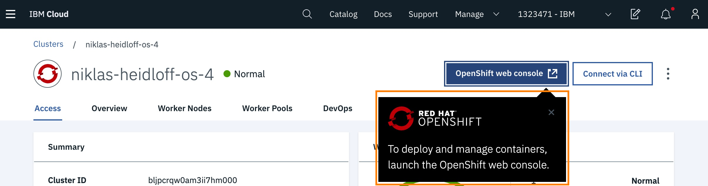
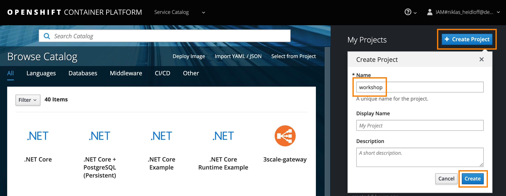
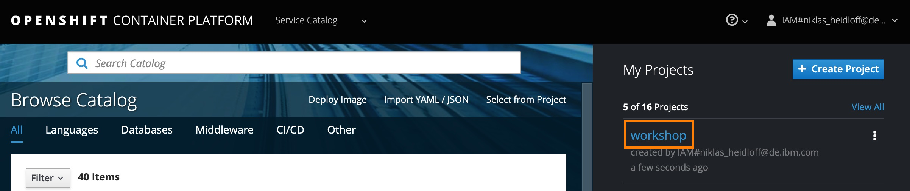
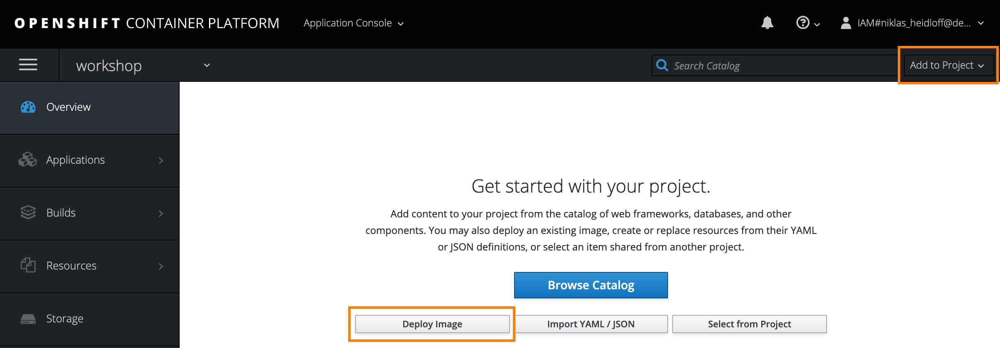
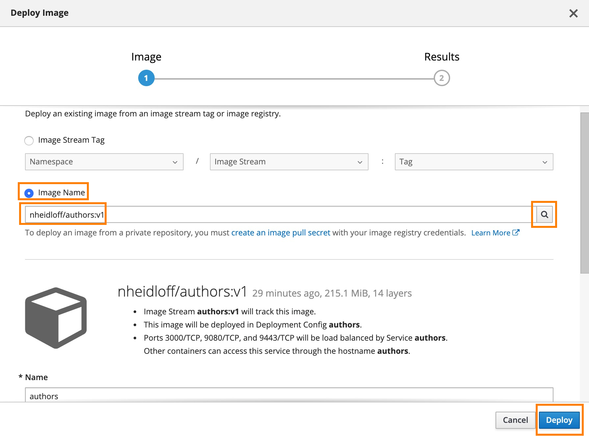
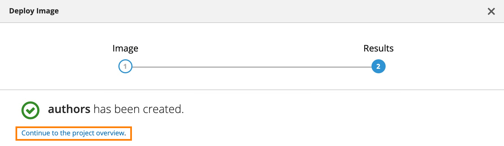
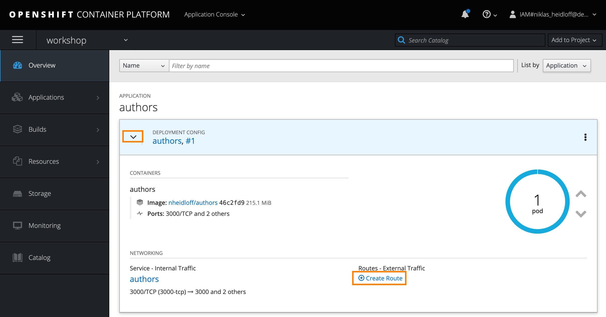
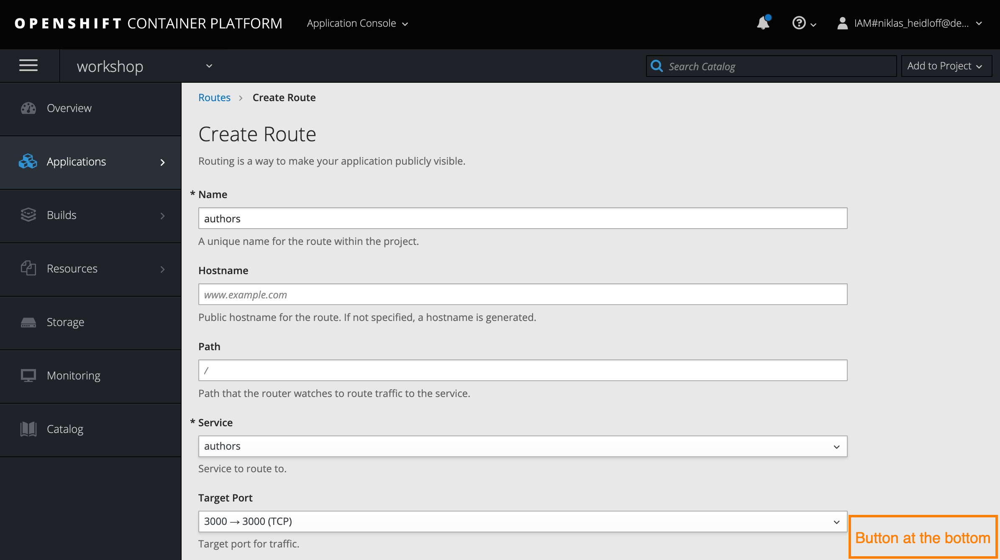
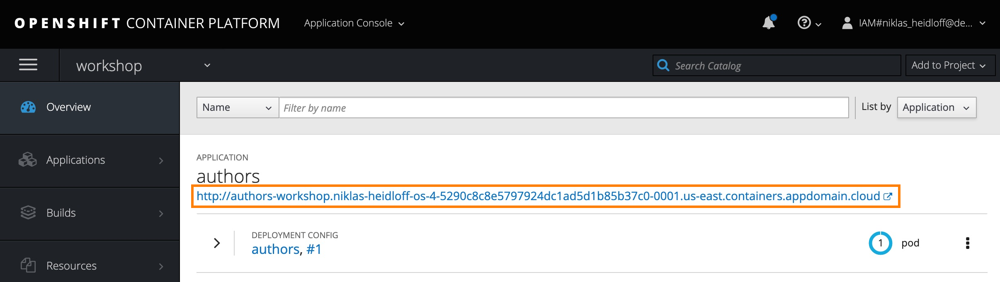
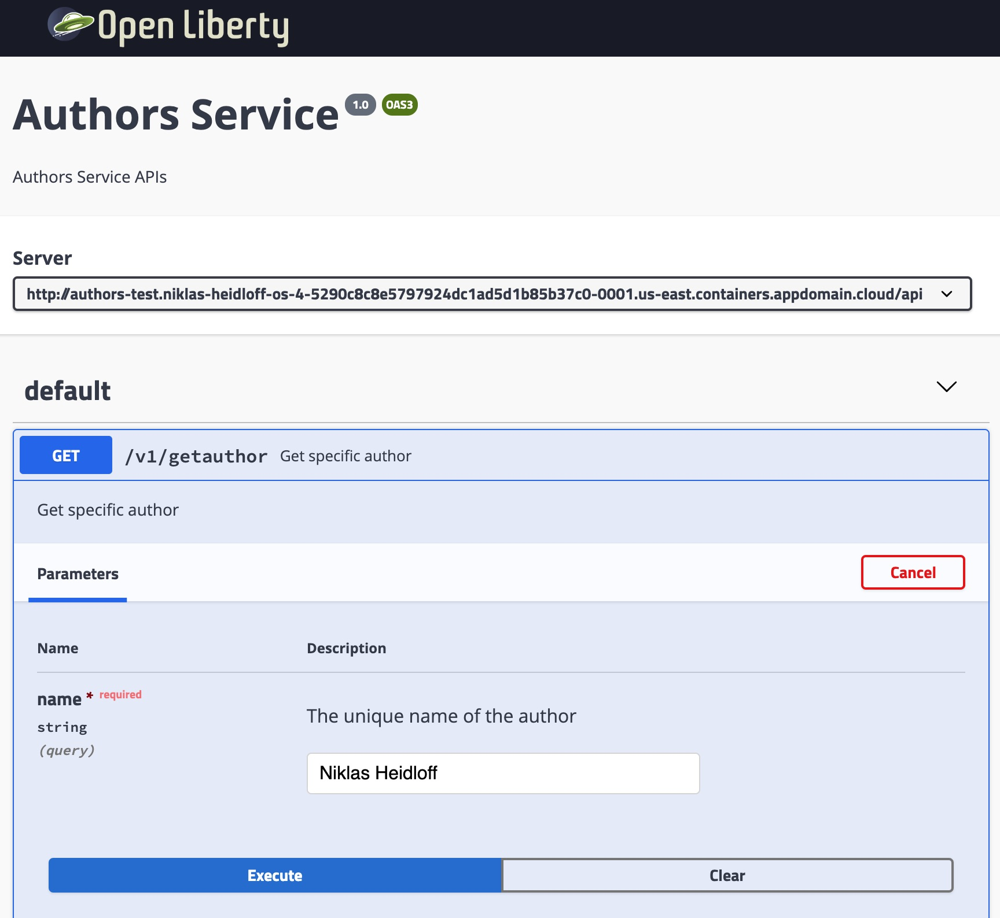

# Lab 5 - Deploying existing Images from Docker Hub

This is a quick lab that demonstrates how to deploy a public image from Docker Hub on OpenShift. As example image the 'authors' microservice from this workshop is used.

Note: Not all images from Docker Hub can be installed. For example OpenShift doesn't allow to deploy images which run under 'root'. See the OpenShift [documentation](https://docs.openshift.com/container-platform/3.3/creating_images/guidelines.html) for details.

## Step 1

Open the OpenShift Console from the IBM Cloud OpenShift dashboard.

<kbd></kbd>

## Step 2

Create a new project 'workshop'.

<kbd></kbd>

## Step 3

Open the new project.

<kbd></kbd>

## Step 4

Click 'Add to Project', followed by 'Deploy Image' in the pop up menu and then 'Deploy Image' in the dialog.

<kbd></kbd>

## Step 5

Enter 'nheidloff/authors:v1' as the image name, click the search icon and then the 'Deploy' button.

<kbd></kbd>

## Step 6

Navigate back to the overview page.

<kbd></kbd>

## Step 7

Click 'Create Route'.

<kbd></kbd>

## Step 8

Click the 'Create' button (not shown in the screenshot).

<kbd></kbd>

## Step 9

Copy the URL and append '/openapi/ui'.

<kbd></kbd>

## Step 10

Open the Open API user interface to try the REST API.

<kbd></kbd>


## Optional: Use your own Image

If you want you can make changes to the Java code and/or image and push these changes to your own Docker Hub account. In order to do this, you need a Docker Hub account and invoke these commands:

```
$ cd ${ROOT_FOLDER}/2-deploying-to-openshift
$ DOCKER_ACCOUNT=<your-docker-account>
$ docker login
$ docker build -t $DOCKER_ACCOUNT/authors:v1 .
$ docker push $DOCKER_ACCOUNT/authors:v1
```

---

__Continue with [Lab 6 - Deployments of Code in GitHub Repos](./6-github.md)__
