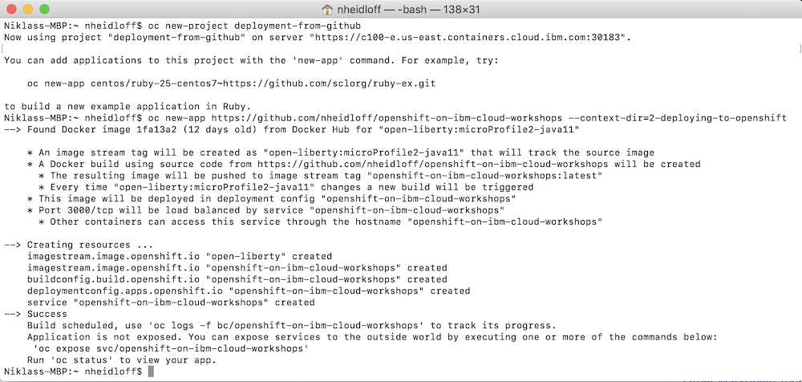
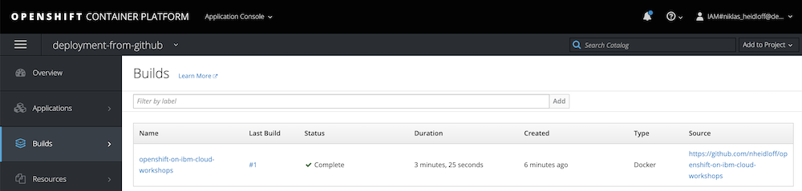
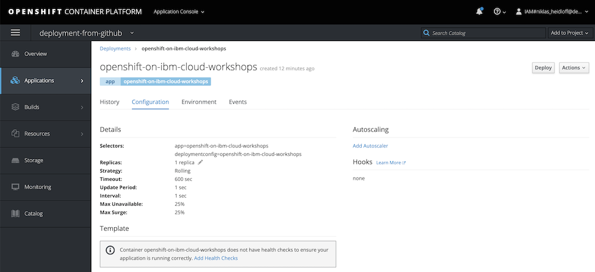
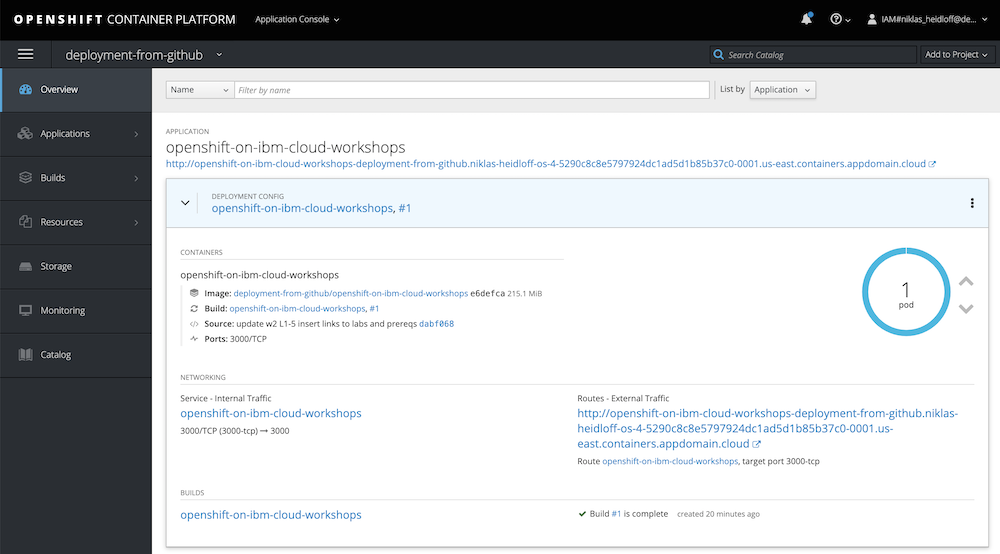

# Lab 6 - Deployments of Code in GitHub Repos

This lab shows how to deploy applications from Git repositories.

This deployment option checks whether a Dockerfile exist. With the Dockerfile a build on OpenShift is initiated. Since we use a Dockerfile with two stages, both the Java code is built as well as the Docker image.

Note that the yaml files are ignored with this approach.

Read the [documentation](https://docs.openshift.com/enterprise/3.0/dev_guide/new_app.html#specifying-source-code) for more details.

### Step 1

Create a new project 'deployment-from-github'.

```
$ oc new-project deployment-from-github
```

### Step 2

Create a new application and refer to a subdirectory in the GitHub repo.

```
$ oc new-app https://github.com/nheidloff/openshift-on-ibm-cloud-workshops --context-dir=2-deploying-to-openshift
```

As result you'll get this output.

<kbd></kbd>

A build will be triggered and run on OpenShift.

<kbd></kbd>

After the build the pod and the service will be deployed. Note that the healthchecks defined in the yaml file are missing, since the yaml files are not used. Instead OpenShift uses intelligent defaults for as many settings as possible. 

<kbd></kbd>

### Step 3

In the last step create a route.

```
$ oc expose svc/openshift-on-ibm-cloud-workshops
$ oc get route/openshift-on-ibm-cloud-workshops
```

To test the deployment, append '/openapi/ui' to the URL in the output of 'oc get route/openshift-on-ibm-cloud-workshops' and open it in a browser.

This is the deployed application with the route.

<kbd></kbd>

---

__Continue with [Lab 7 - Source to Image Deployments](./7-source-to-image.md)__
