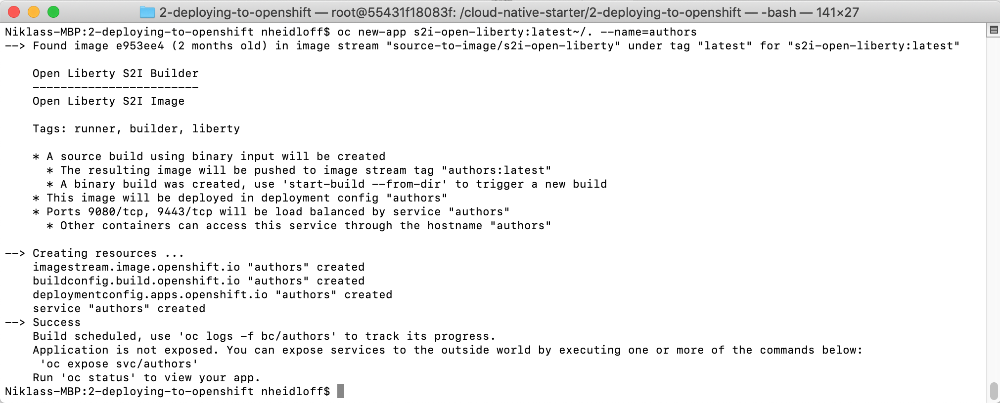

# Lab 7 - Source to Image Deployments

OpenShift allows developers to deploy applications without having to understand Docker and Kubernetes in depth. Similarily to the Cloud Foundry 'cf push' experience, developers can deploy applications easily via terminal commands and without having to build Docker images. In order to do this [Source-to-Image](https://github.com/openshift/source-to-image) is used.

Source-to-Image (S2I) is a toolkit for building reproducible container images from source code. S2I produces ready-to-run images by injecting source code into a container image.

In order to use S2I, builder images are needed. These builder images create the actual images with the applications. The builder images are similar to Cloud Foundry buildpacks.

## Deployment of the Open Liberty Builder Image

OpenShift provides several builder images out of the box, for example for Node.js and Wildfly applications. In order to support other runtimes, for example Open Liberty, custom builder images can be built and deployed. Since this workshop uses Open Liberty, we will use a [builder image for Open Liberty](https://github.com/nheidloff/s2i-open-liberty) which needs to be deployed before the actual Open Liberty microservice can be deployed.

In order to deploy the image builder 'nheidloff/s2i-open-liberty' the OpenShift Web Console is used.

### Step 1

Create a new project 'source-to-image'.

<kbd></kbd>

### Step 2

In order to open the registry console, choose the default project, expand registry-console and click on the URL.

<kbd></kbd>

### Step 3

Click on 'Images', then select the project 'source-to-image' and then click on 'New image stream'. In the dialog use 'source-to-image' as name and refer to the image on Docker Hub 'nheidloff/s2i-open-liberty'.

An image stream is an OpenShift abstraction to access images. In this case we are using it to pull images from Docker Hub into the OpenShift registry.

<kbd></kbd>

### Step 4

It will take some time to pull the image. After this the image will show up in the user interface.

<kbd></kbd>

## Deployment of the Microservice

The previous steps to install the Open Liberty builder image only have to be executed once. After this multiple Open Liberty applications can be deployed without Dockerfiles and yaml files.

### Step 5

The image builder expects a certain directory structure of Open Liberty projects with two files:

* server.xml in the root directory
* *.war file in the target directory

Before the code can be pushed to OpenShift, the 'war' file (Java web archive with microservice) needs to be built with Maven.

The tools image 'nheidloff/openshift-workshop-tools:v1' comes with Maven installed. Run the tools image from the root directory.

```
$ cd ${ROOT_FOLDER}
$ docker run -v $ROOT_FOLDER/:/cloud-native-starter -it --rm nheidloff/openshift-workshop-tools:v1
```

In the terminal with the running tools container, invoke these commands to start the Java build process.

```
$ cd /cloud-native-starter/
$ ROOT_FOLDER=$(pwd)
$ cd ${ROOT_FOLDER}/2-deploying-to-openshift
$ mvn package
```

After you've run these commands, the file 'authors.war' will appear in the 'target' directory.

Alternatively you can also run Maven locally, if you've [installed](https://maven.apache.org/install.html) it. In this case invoke the commands on your local machine:

```
$ cd ${ROOT_FOLDER}/2-deploying-to-openshift
$ mvn package
```

### Step 6

Next we create a new OpenShift application (our microservice) in our 'source-to-image' project.

We define in the first parameter of the 'oc new-app' command that we want to use the Open Liberty builder image to produce the production image with Open Liberty and our microservice.

```
$ cd ${ROOT_FOLDER}/2-deploying-to-openshift
$ oc project source-to-image
$ oc new-app s2i-open-liberty:latest~/. --name=authors
```

After this you should see this:

<kbd></kbd>

### Step 7

Before the microservice can be deployed with the image builder, the code (or more previously 'authors.jar' and 'server.xml') need to be uploaded to OpenShift. This is done via 'oc start-build'.

In the 'oc start-build' command we refer to the code of our Java microservice in the current directory.

```
$ oc start-build --from-dir . authors 
```

After a couple of seconds you can see the successful build in the OpenShift Web Console.

<kbd></kbd>

Note that at this point the pod is not running yet as indicated by 'Rolling deployment is running ...'. After you've waited another minute, the pod will be ready and the grey circle will turn blue.

### Step 8

In the last step the route has to be created as in the previous labs.

```
$ oc expose svc/authors
$ oc get route/authors
```

To test the deployment, append '/openapi/ui' to the URL in the output of 'oc get route/authors' and open it in a browser.
