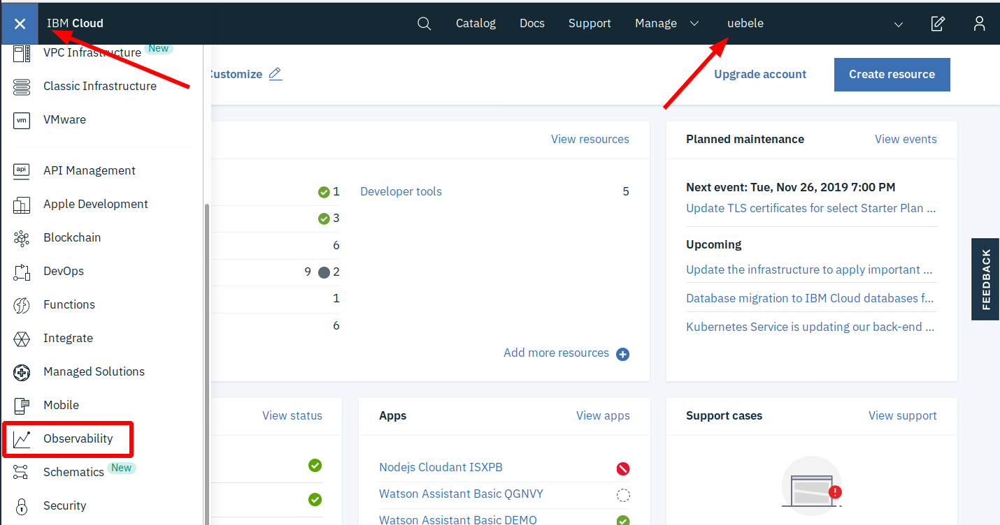
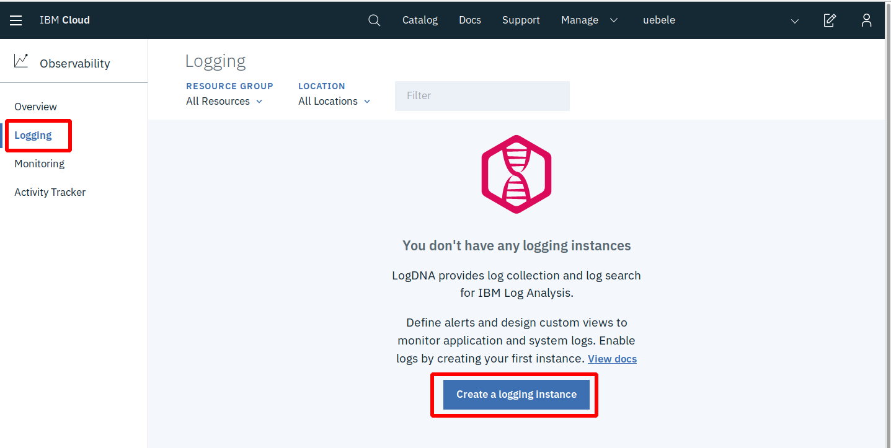
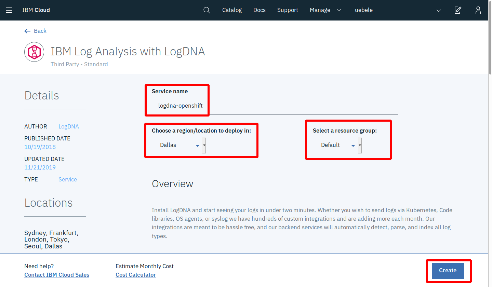
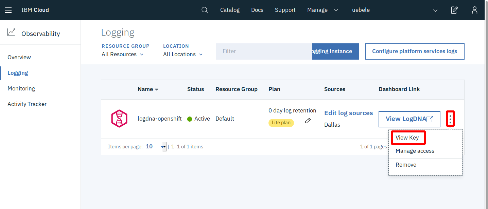
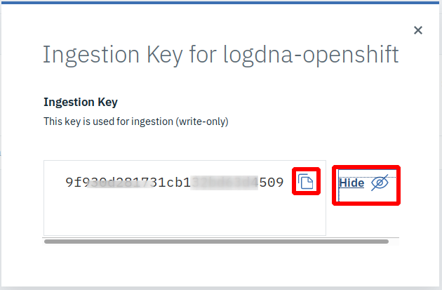
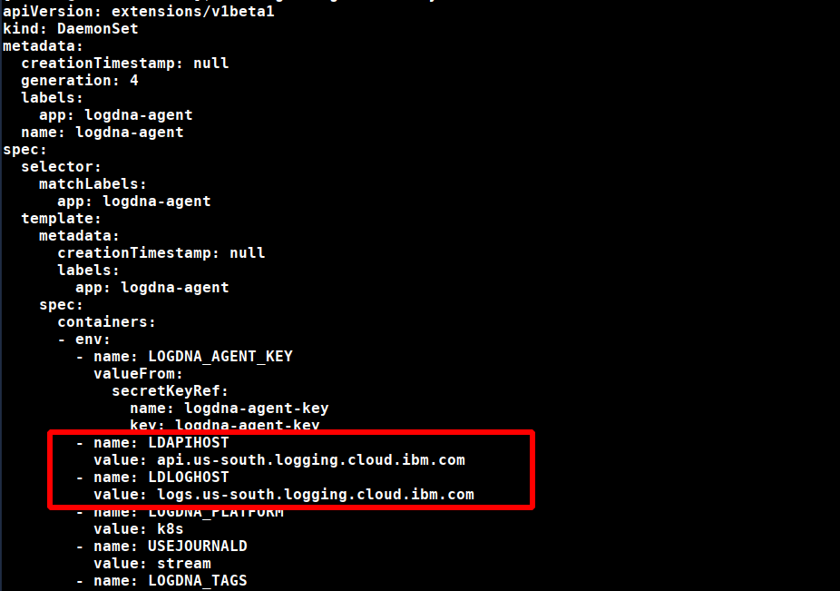

# Lab 8 - Distributed logging with LogDNA and OpenShift on IBM Cloud

A cloud native application based on microservices contains many parts that create logs. A logging service that is able to collect all distributed logs in one place is a highly recommended tool. There are many logging solutions that you can install directly into your Kubernetes or OpenShift cluster. But then you have an additional application that needs to be maintained and one that needs persistent storage as well to store logs for a period of time. 

IBM Cloud offers "Logging as a Service" in the form of [IBM Log Analysis with LogDNA](https://cloud.ibm.com/docs/services/Log-Analysis-with-LogDNA?topic=LogDNA-getting-started#getting-started). It offers features to filter, search, and tail log data, define alerts, and design custom views to monitor application and system logs. You can test "IBM Log Analysis with LogDNA" for free with somewhat limited capabilities and we will show you in this lab how to connect your OpenShift cluster to an instance of it.

Official documentation for setting up the LogDNA agent for an OpenShift cluster is [here](https://cloud.ibm.com/docs/services/Log-Analysis-with-LogDNA?topic=LogDNA-config_agent_os_cluster).

For the following instructions use the [Tools](https://github.com/nheidloff/openshift-on-ibm-cloud-workshops/blob/master/2-deploying-to-openshift/documentation/1-prereqs.md#tools) environment created in Lab 1 - Prerequisites.

## Step 1 - Create a LogDNA service

1. In your browser log in to the IBM Cloud dashboard

   * Make sure you are using your own account.

   * From the "burger menu" select "Observability"

   


2. Create an "IBM Log Analysis with LogDNA" instance

   * Select "Logging" on the left
   
   * Click "Create a logging instance"

   

   * Leave the default name or choose your own ("logdna-openshift")

   * Select a region close to your OpenShift cluster

   * Leave the "Default" resource group

   * Scroll down to the Pricing Plans and make sure that "Lite" is selected but take note of the other plans; those are the full featured plans. But you need a paid account to use those. We will use Lite for this lab.

   * Click "Create".

   
  
3. Obtain the Ingestion Key

   This is the key that a LogDNA agent running in your OpenShift cluster needs to write data into your newly created LogDNA instance.

   * In the Observability / Logging view click on the 3 dots on the right side of your newly created LogDNA service.

   * Select "View Key"

   

   * In the "Ingestion Key" dialog, make the key visible, copy it to the clipboard, and save it somewhere. You will need it in Step 2. 

   

## Step 2 - Configure the OpenShift cluster for LogDNA

1. Log in to your OpenShift cluster with `oc`, instructions are [here](https://github.com/nheidloff/openshift-on-ibm-cloud-workshops/blob/master/2-deploying-to-openshift/documentation/1-prereqs.md#step-2-get-our-access-token-for-the-oc-cli)  

2. Create an OpenShift project for LogDNA and adjust permissions

   ```
   $ oc adm new-project --node-selector='' ibm-observe
   $ oc create serviceaccount logdna-agent -n ibm-observe
   $ oc adm policy add-scc-to-user privileged system:serviceaccount:ibm-observe:logdna-agent
   ```

3. Create a Kubernetes secret

   For the next command you need the LogDNA Ingestion Key you obtained (and saved) in the last step:

   ```
   $ oc create secret generic logdna-agent-key --from-literal=logdna-agent-key=<Ingestion_Key> -n ibm-observe
   ```

4. Create a LogDNA Agent daemon set

   A Kubernetes daemon set will deploy the LogDNA Agent on every worker node of your cluster.

   You need to edit the file [logdna-agent-ds-os.yaml](../logdna-agent-ds-os.yaml). There is a copy in the root of this project (2-deploying-to-openshift). Edit the values of LDAPIHOST and LDLOGHOST to point to the region where your LogDNA instance is located, e.g.
    au-syd = Sydney   
    jp-tok = Tokyo   
    kr-seo = Seoul   
    eu-de = Frankfurt   
    eu-gb = London   
    us-south = Dallas   

   

   Save the file. Then create the daemon set:

   ```
   $ oc create -f logdna-agent-ds-os.yaml -n ibm-observe
   ```
4. Verify that the LogDNA Agent is deployed

   ```
   $ oc project ibm-observe
   $ oc get pods -n ibm-observe
   ```

   You should see at least one LogDNA pod. The number of pods is equivalent to the number of worker nodes of your cluster.


## Step 3 - Use LogDNA

1. Log into the IBM Cloud Dashboard
2. From the Burger menu in the upper left corner select "Observability"
3. In the Observability menu select "Logging"
4. Click on "View LogDNA"


   This will open the LogDNA dashboard. 

5. In Lab 4 "[Deploying to OpenShift](4-openshift.md)" you have deployed an instance of the authors service. We will check LogDNA for output from this instance. Execute the following commands:

   ```
   $ oc project cloud-native-starter
   $ watch curl -X GET "http://$(oc get route authors -o jsonpath={.spec.host})/api/v1/getauthor?name=Niklas%20Heidloff" -H "accept: application/json"
   ```
   
The "watch" command will constantly (every 2 seconds) request author information.

6. Refresh your browser tab with the LogDNA dashboard, open the  "All Apps" pulldown, and select "authors":


  Note: If you don't see "authors" wait a little longer (with the free/lite version it can take several minutes before data shows up), then refresh the browser tab of the LogDNA dashboard again.

7. You should now see messages from the authors service alone:


8. Terminate the command from step 5 ("watch curl ...")

:star: __Congratulation! You completed the workshop!__