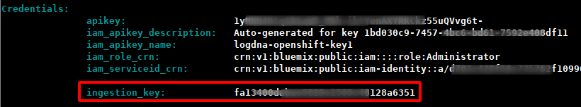

# Lab 8 - Distributed logging with LogDNA and OpenShift on IBM Cloud

A cloud native application based on microservices contains many parts that create logs. A logging service that is able to collect all distributed logs in one place is a highly recommended tool. There are many logging solutions that you can install directly into your Kubernetes or OpenShift cluster. But then you have an additional application that needs to be maintained and one that needs persistent storage as well to store logs for a period of time. 

IBM Cloud offers "Logging as a Service" in the form of [IBM Log Analysis with LogDNA](https://cloud.ibm.com/docs/services/Log-Analysis-with-LogDNA?topic=LogDNA-getting-started#getting-started). It offers features to filter, search, and tail log data, define alerts, and design custom views to monitor application and system logs. You can test "IBM Log Analysis with LogDNA" for free with somewhat limited capabilities and we will show you in this lab how to connect your OpenShift cluster to an instance of it.

## Step 1 - Create a LogDNA service

Use the [Tools](https://github.com/nheidloff/openshift-on-ibm-cloud-workshops/blob/master/2-deploying-to-openshift/documentation/1-prereqs.md#tools) environment created in Lab 1 - Prerequisites.

1. Log in to the IBM Cloud

   ```
   $ ibmcloud login -u <your_user>
   $ ibmcloud target -g Default
   ```

2. Create an IBM Log Analysis with LogDNA instance

   ```
   $ ibmcloud resource service-instance-create logdna-openshift logdna lite <region>
   ```
   Possible regions are kr-seo (= Korea), us-south (= US), au-syd (= Australia), eu-de (= Germany), eu-gb (= UK), jp-tok (= Japan). Use a region close to your OpenShift cluster, e.g. Germany:

   ```
   $ ibmcloud resource service-instance-create logdna-openshift logdna lite eu-de
   ```

   Note the "ID:" line in the output, e.g. 
   
   ```
   crn:v1:bluemix:public:logdna:eu-de:a/d703c429f50c735762f10996893f3189:86763bbd-0c29-4f65-96f8-d9db394e8e86::
   ```

3. Create an "Ingestion" key

   ```
   $ ibmcloud resource service-key-create logdna-openshift-key Administrator --instance-id <logdna_instance_ID>
   ```

   Using our example above (including the two colons at the end) this command looks like this:

   ```
   $ ibmcloud resource service-key-create logdna-openshift-key Administrator --instance-id crn:v1:bluemix:public:logdna:eu-de:a/d703c429f50c735762f10996893f3189:86763bbd-0c29-4f65-96f8-d9db394e8e86::
   ```
   Result:
   
   You will need the "ingestion_key" line from the output in the next step, e.g.

   ```
   a1ffd5dda2fabb87a7804943ef85de54
   ```

## Step 2 - Configure the OpenShift cluster for LogDNA

1. Log in to your OpenShift cluster with `oc`, instructions are [here](https://github.com/nheidloff/openshift-on-ibm-cloud-workshops/blob/master/2-deploying-to-openshift/documentation/1-prereqs.md#step-2-get-our-access-token-for-the-oc-cli)  

2. Create an OpenShift project

   ```
   $ oc adm new-project logdna-agent
   $ oc project logdna-agent
   $ oc create serviceaccount logdna-agent
   $ oc adm policy add-scc-to-user privileged -n logdna-agent -z logdna-agent
   ```

3. Create a Kubernetes secret

   ```
   $  oc create secret generic logdna-agent-key --from-literal=logdna-agent-key=<logDNA_ingestion_key>
   ```

   This is the ingestion_key from "Create an Ingestion key" (previous step).


4. Create a LogDNA daemon set

   ```
   $ oc create -f https://raw.githubusercontent.com/logdna/logdna-agent/master/logdna-agent-ds-os.yaml
   ```

5. Edit the daemon set. Download a local copy of the configuration, modify, then reapply:

   ```
   $ oc get ds logdna-agent -n logdna-agent -o yaml > logdna-ds.yaml
   ```

   In the tools container, you can edit with nano:

   ```
   $ nano logdna-ds.yaml
   ```

   These are the required changes:
   1. In the spec.spec.containers.env section:
      - Add the LDAPIHOST and LDLOGHOST variables
      ```
      - name: LDAPIHOST
        value: api.<region>.logging.cloud.ibm.com
      - name: LDLOGHOST
        value: logs.<region>.logging.cloud.ibm.com
        ```
      Specify the region of your LogDNA instance
      - Change USEJOURNALD to 'stream'
   2. In the spec.spec.containers.volumemounts section:
      Add the /var/data/kubeletlogs entry  
      ```
       - mountPath: /var/data/kubeletlogs
         name: vardatakubeletlogs
      ```
   3. In the spec.spec.volumes section:
      Add the /var/data/kubeletlogs entry
      ```
      - hostPath:
          path: /var/data/kubeletlogs
        name: vardatakubeletlogs
      ```
    Save the file (nano: Ctl-o, Ctl-x)

These are the relevant parts, watch out for the YAML indentations!

```
apiVersion: extensions/v1beta1
kind: DaemonSet
...
spec:
  ...
    spec:
      containers:
      - env:
        - name: LOGDNA_AGENT_KEY
          valueFrom:
            secretKeyRef:
              key: logdna-agent-key
              name: logdna-agent-key
        - name: LDAPIHOST
          value: api.us-south.logging.cloud.ibm.com
        - name: LDLOGHOST
          value: logs.us-south.logging.cloud.ibm.com
        - name: LOGDNA_PLATFORM
          value: k8s
        - name: USEJOURNALD
          value: stream
  ...  
        volumeMounts:
        - mountPath: /var/data/kubeletlogs
          name: vardatakubeletlogs
        - mountPath: /var/log
          name: varlog
  ... 
      volumes:
      - hostPath:
          path: /var/data/kubeletlogs
        name: vardatakubeletlogs
      - hostPath:
          path: /var/log
          type: ""
        name: varlog
  ...
```
6. Apply the changes

   ```
   $ oc apply -f logdna-ds.yaml
   $ oc get pods
   ```

   This should show a LogDNA pod. To make sure that the changed configuration is really applied, delete this pod with

   ```
   $ oc delete pod <logdna-agent-123456>
   ```

   It will be recreated automatically.

## Step 3 - Use LogDNA

1. Log into the IBM Cloud Dashboard
2. From the Burger menu in the upper left corner select "Observability"
3. In the Observability menu select "Logging"
4. Click on "View LogDNA"


   This will open the LogDNA dashboard. 

5. In Lab 4 "[Deploying to OpenShift](4-openshift.md)" you have deployed an instance of the authors service. We will check LogDNA for output from this instance. Execute the following commands:

   ```
   $ oc project cloud-native-starter
   $ watch curl -X GET "http://$(oc get route authors -o jsonpath={.spec.host})/api/v1/getauthor?name=Niklas%20Heidloff" -H "accept: application/json"
   ```
   
The last command will constantly (every 2 seconds) request author information.

6. Refresh your browser tab with the LogDNA dashboard, open the  "All Apps" pulldown, and select "authors":


  Note: If you don't see "authors" wait a little longer (more curls), then refresh the browser tab of the LogDNA dashboard again.

7. You should now see messages from the authors service alone:


8. Terminate the command from step 5 ("watch curl ...")

:star: __Congratulation! You completed the workshop!__