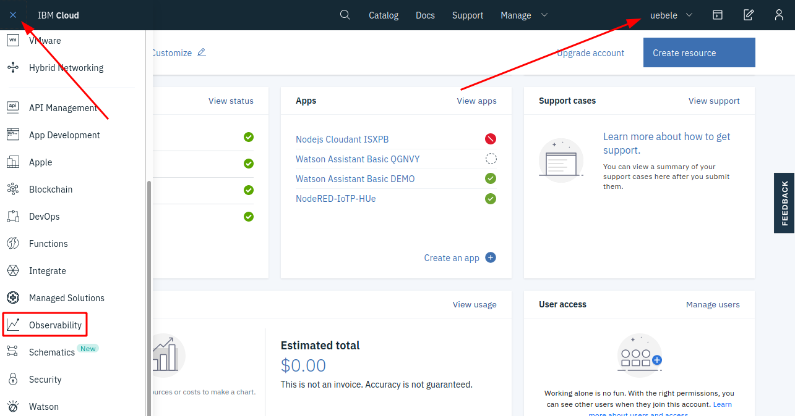
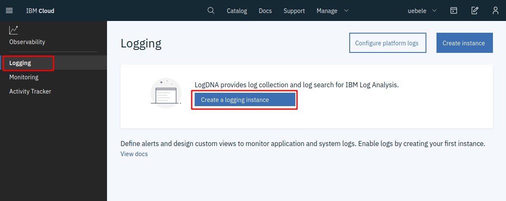
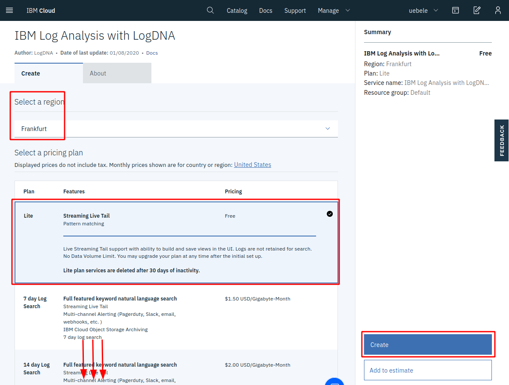
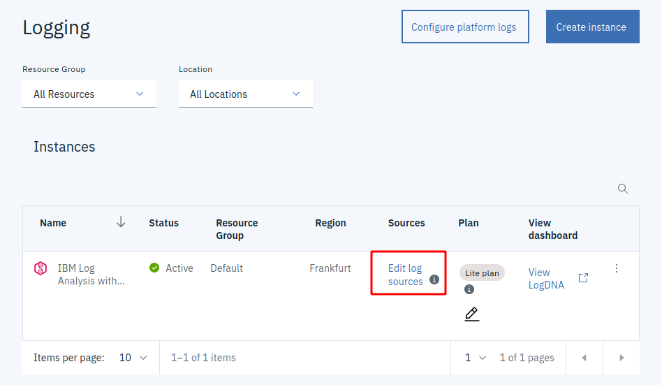
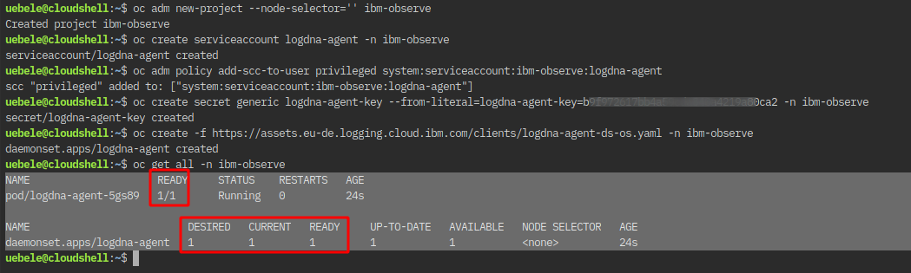
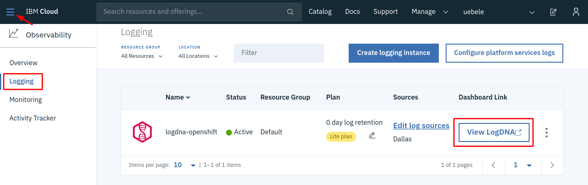
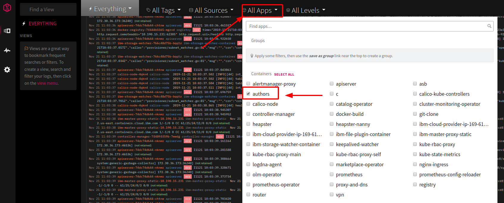
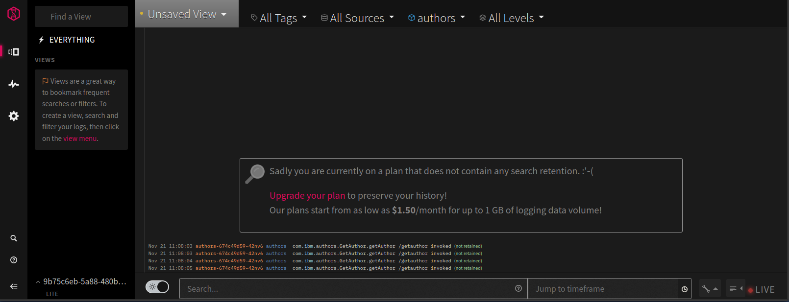

# Lab 5 - Distributed logging with LogDNA and OpenShift on IBM Cloud

A cloud native application based on microservices contains many parts that create logs. A logging service that is able to collect all distributed logs in one place is a highly recommended tool. There are many logging solutions that you can install directly into your Kubernetes or OpenShift cluster. But then you have an additional application that needs to be maintained and one that needs persistent storage as well to store logs for a period of time. 

IBM Cloud offers "Logging as a Service" in the form of [IBM Log Analysis with LogDNA](https://cloud.ibm.com/docs/services/Log-Analysis-with-LogDNA?topic=LogDNA-getting-started#getting-started). It offers features to filter, search, and tail log data, define alerts, and design custom views to monitor application and system logs. You can test "IBM Log Analysis with LogDNA" for free with somewhat limited capabilities and we will show you in this lab how to connect your OpenShift cluster to an instance of it.

Official documentation for setting up the LogDNA agent for an OpenShift cluster is [here](https://cloud.ibm.com/docs/services/Log-Analysis-with-LogDNA?topic=LogDNA-config_agent_os_cluster).

For the following instructions use the IBM Cloud Shell to enter the commands.

## Step 1 - Create a LogDNA service

1. In your browser log in to the IBM Cloud dashboard

   * Make sure you are using **your own account**.

   * From the "burger menu" select "Observability"

   


1. Create an "IBM Log Analysis with LogDNA" instance

    * Select "Logging" on the left
   
   * Click "Create a logging instance"

   

   * Leave the default name or choose your own ("logdna-openshift")

1. In the next dialog:

   * Select a region close to your OpenShift cluster

   * Leave the "Lite" pricing plan but take note of the other plans; those are the full featured plans. But you need a paid account to use those. We will use Lite for this lab.

   * Scroll down a bit

   * Leave the service name and the "Default" resource group

   * Click "Create" at the bottom of the dialog.

   

  
1. Click on "Edit log sources"

   

1. Select the "OpenShift" tab. Copy, paste, and execute the commands into your IBM Cloud Shell:

   

1. Check that the logging agent is running with:

   ```
   $ oc get all -n ibm-observe
   ```
 
   


## Step 2 - Use LogDNA

1. Go back to the IBM Cloud Dashboard
2. From the Burger menu in the upper left corner select "Observability"
3. In the Observability menu select "Logging"
4. Click on "View LogDNA"

   

   This will open the LogDNA dashboard. 

5. In Lab 4 "[Deploying to OpenShift](4-openshift.md)" you have deployed an instance of the authors service. We will check LogDNA for output from this instance. Execute the following commands in the IBM Cloud Shell:

   ```
   $ oc project <your project>
   $ watch curl -X GET "http://$(oc get route authors-bin -o jsonpath={.spec.host})/api/v1/getauthor?name=Niklas%20Heidloff" -H "accept: application/json"
   ```
   
   The "watch" command will constantly (every 2 seconds) request author information.

6. Refresh your browser tab with the LogDNA dashboard, open the  "All Apps" pulldown, and select "authors":

   

    Note: If you don't see "authors" wait a little longer (with the free/lite version it can take several minutes before data shows up), then refresh the browser tab of the LogDNA dashboard again.

7. You should now see messages from the authors service alone:

   

8. Terminate the command from step 5 ("watch curl ...")

---

__Continue with [Lab 6 - Deploying existing Images from Docker Hub](./6-existing-image.md)__
