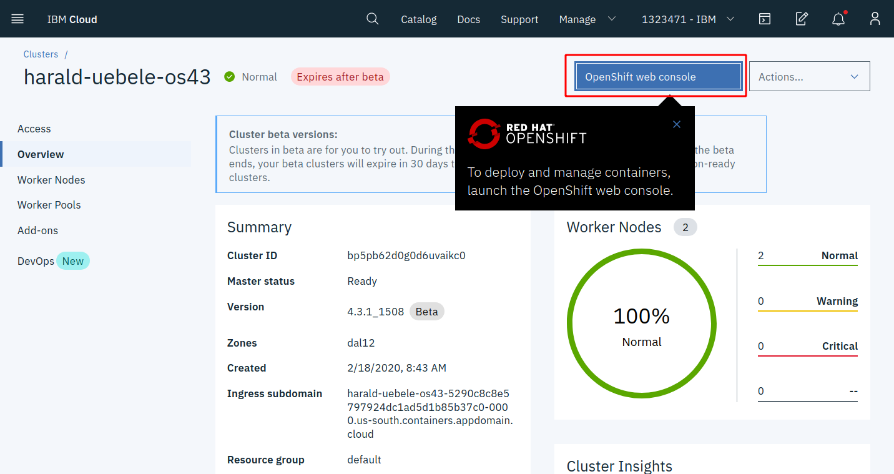
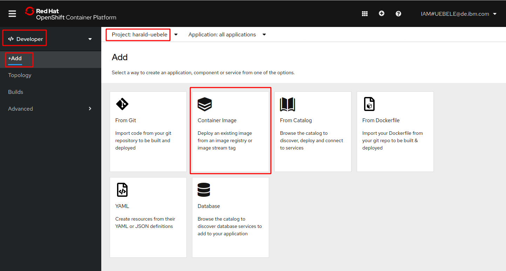
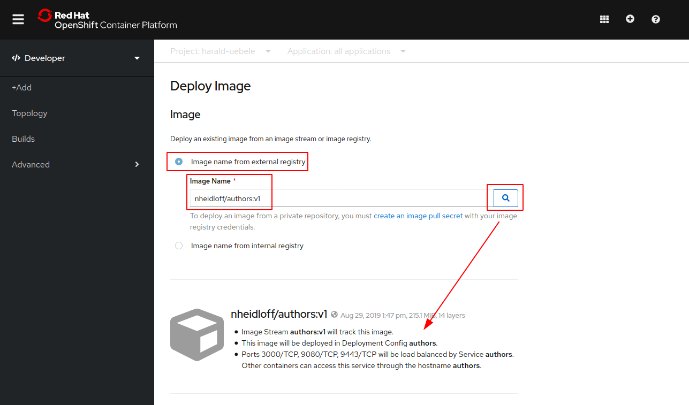
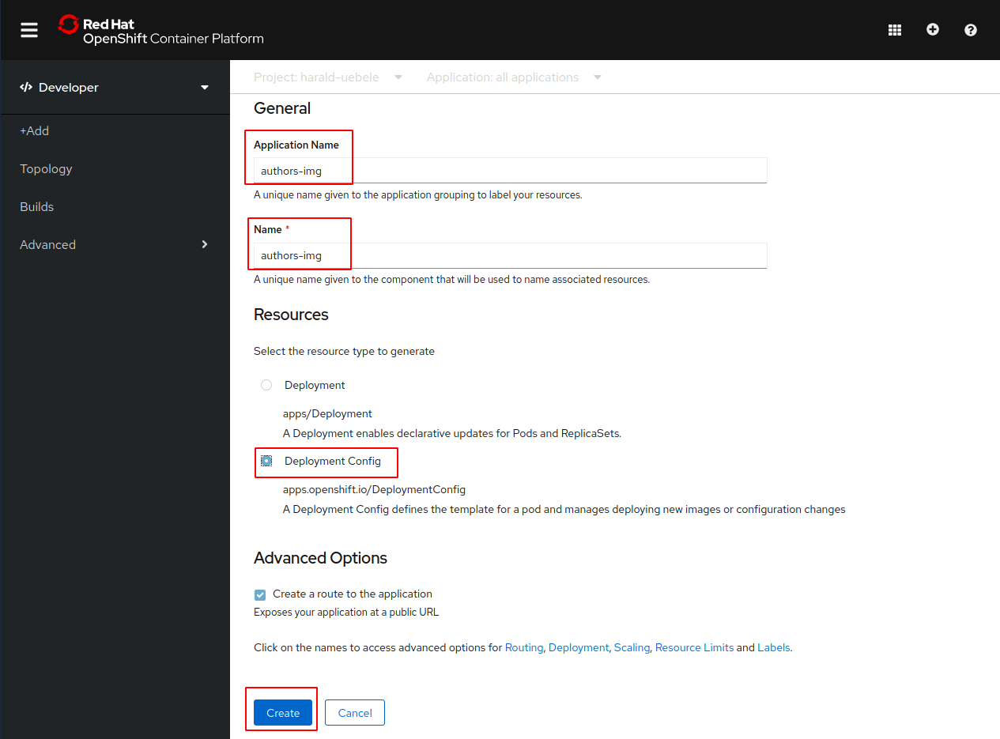
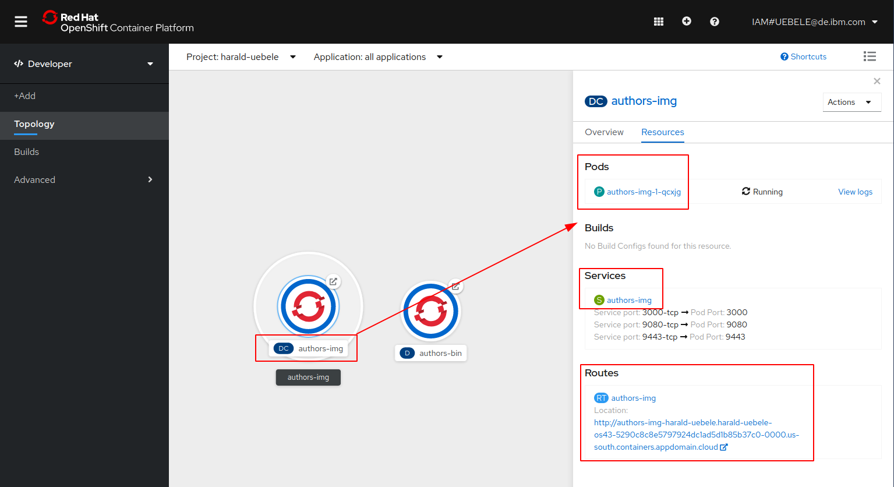
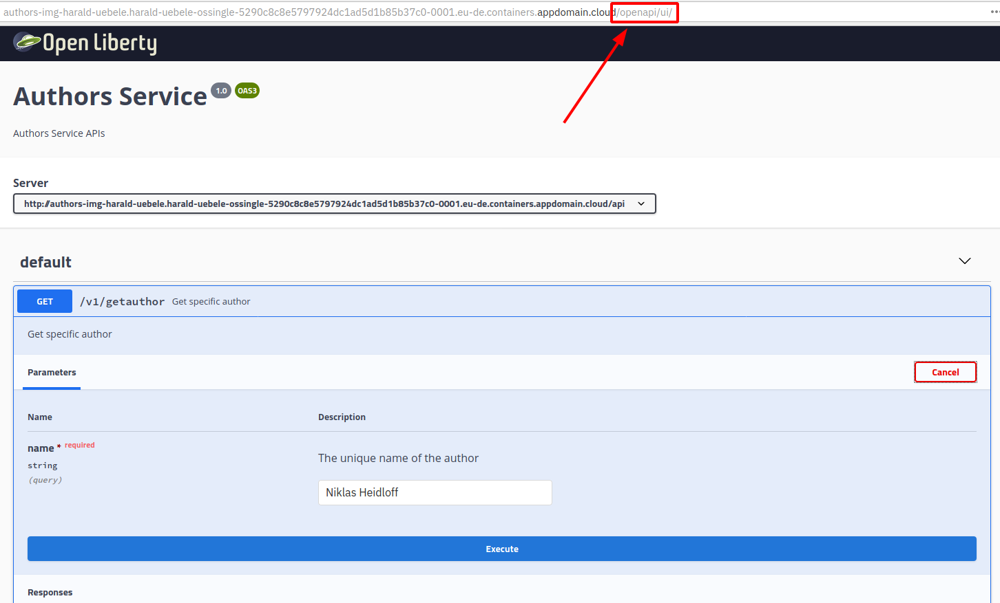

# Lab 6 - Deploying existing Images from Docker Hub


## Overview

This is a quick lab that demonstrates how to deploy a public image from Docker Hub onto OpenShift. As starting point an image of the 'authors' microservice from this workshop has already been loaded on Docker Hub.

Note: Not all images from Docker Hub can be used on OpenShift. For example, OpenShift does not run containers as 'root' which means that a lot of images from Docker Hub won't start. See the OpenShift [documentation](https://docs.openshift.com/container-platform/4.3/openshift_images/create-images.html) for details.

## Step 1

If it isn't already open, open the OpenShift Web Console from the IBM Cloud OpenShift dashboard.

<kbd></kbd>

## Step 2

In the 'Developer' view, select '+Add', and make sure your project is selected. Then click on 'Container Image':

<kbd></kbd>

## Step 3

Select 'Image name from external registry', enter 'nheidloff/authors:v1' as the image name, then click the search icon. This will retrieve and display image information from DockerHub.

<kbd></kbd>

Scroll down. 
Change 'Application Name' and 'Name' to "authors-img".
Select 'Deployment Config' as 'Resource'.
Leave the option to create a route checked.
Click on 'Create'.

<kbd></kbd>

## Step 4

Back to the 'Topology' view click on "DC authors-img". In the 'Resources' view you can see a pod, a service, and a route:

<kbd></kbd>

## Step 5

Click on the URL of 'authors-img' Route, this will open the default Open Liberty Welcome page. Append '/openapi/ui' to the URL.

This opens the Open API user interface to try the REST API.

<kbd></kbd>


## Optional: Use your own Image

If you want you can make changes to the Java code and/or image and push these changes to your own Docker Hub account. In order to do this, you need a Docker Hub account and invoke these commands:

```
$ cd ${ROOT_FOLDER}/deploying-to-openshift
$ DOCKER_ACCOUNT=<your-docker-account>
$ docker login
$ docker build -t $DOCKER_ACCOUNT/authors:v1 .
$ docker push $DOCKER_ACCOUNT/authors:v1
```

---

__Continue with [Lab 7 - Deployments of Code in GitHub Repos](./7-github.md)__
