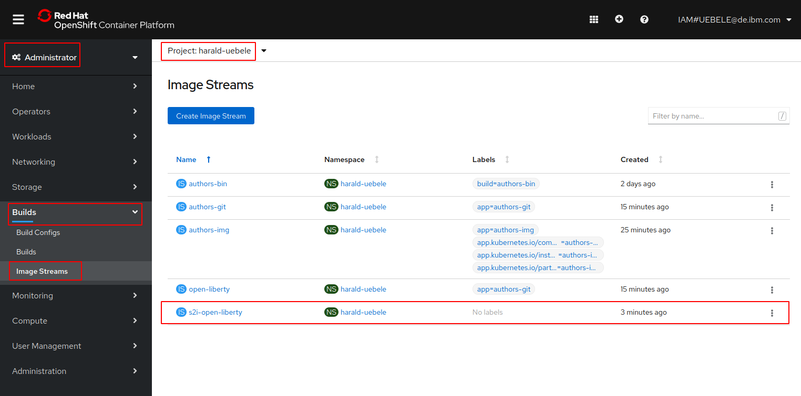
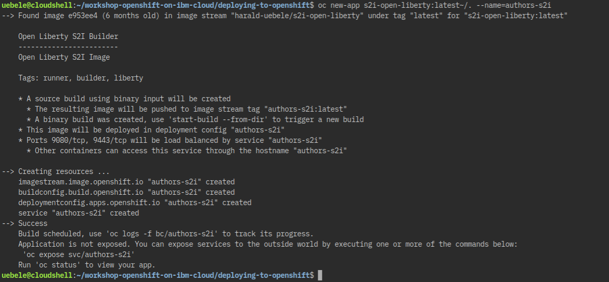
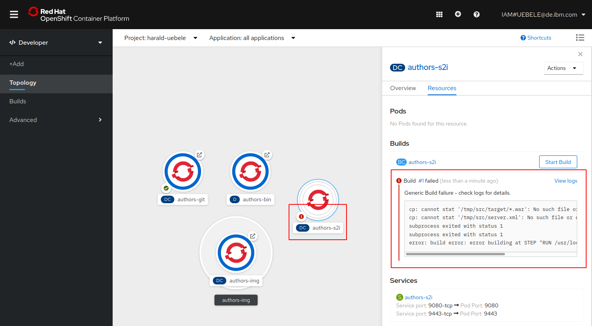
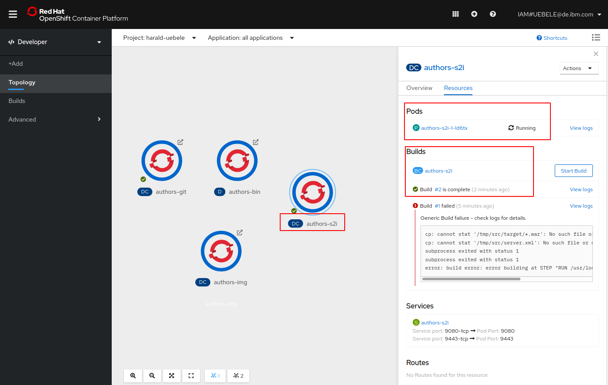
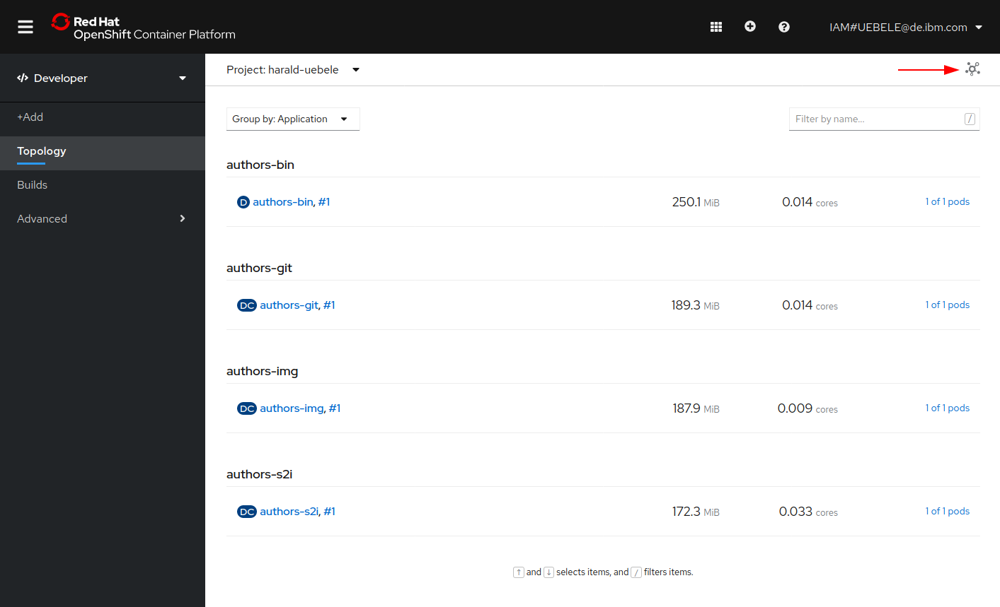

# Lab 8 - Source to Image Deployments

## Overview

OpenShift allows developers to deploy applications without having to understand Docker and Kubernetes in depth. Similarily to the Cloud Foundry 'cf push' experience, developers can deploy applications easily via terminal commands and without having to build Docker images. In order to do this [Source-to-Image](https://github.com/openshift/source-to-image) is used.

Source-to-Image (S2I) is a toolkit for building reproducible container images from source code. S2I produces ready-to-run images by injecting source code into a container image.

In order to use S2I, builder images are needed. These builder images create the actual images with the applications. The builder images are similar to Cloud Foundry buildpacks.

## 1. Import of the Open Liberty Builder Image

OpenShift provides several builder images out of the box, for example for Node.js and Wildfly applications. In order to support other runtimes, for example Open Liberty, custom builder images can be built and deployed. Since this workshop uses Open Liberty, we will use a [builder image for Open Liberty](https://github.com/nheidloff/s2i-open-liberty) which needs to be imported before the actual Open Liberty microservice can be deployed.


In the Coud Shell check that you are in your own OpenShift project (firstname-lastname):

```
$ oc project
```

Add the Open Liberty builder image to the OpenShift internal image registry:

```
$ oc import-image docker.io/nheidloff/s2i-open-liberty:latest --confirm
```

Result:

```
imagestream.image.openshift.io/s2i-open-liberty imported
Name:                   s2i-open-liberty
Namespace:              harald-uebele
Created:                Less than a second ago
Labels:                 <none>
Annotations:            openshift.io/image.dockerRepositoryCheck=2020-02-20T08:53:53Z
Docker Pull Spec:       image-registry.openshift-image-registry.svc:5000/harald-uebele/s2i-open-liberty
Image Lookup:           local=false
Unique Images:          1
Tags:                   1

latest
  tagged from docker.io/nheidloff/s2i-open-liberty:latest

  * docker.io/nheidloff/s2i-open-liberty@sha256:b9959c8ba775255e48015a119a49ba8aa60c344779d4fe2f65a6310a3231bd89
      Less than a second ago

[...]
 ```     

In the OpenShift Web Console, in your own project, go to 'Builds' and 'Image Streams' and check that the 's2i-open-liberty' image is present:



The other images are the result of your previous deployments.

## 2. Deployment of the Microservice

The previous steps to install the Open Liberty builder image only have to be executed once. After this multiple Open Liberty applications can be deployed without Dockerfiles and yaml files.

### Step 1

The image builder expects a certain directory structure of Open Liberty projects with two files:

* server.xml in the root directory
* *.war file in the target directory

Before the code can be pushed to OpenShift, the 'war' file (Java web archive with microservice) needs to be built with Maven. Note: Maven is installed in the IBM Cloud Shell. If you are not using Cloud Shell you need to have `mvn` installed on your laptop.

```
$ cd ${ROOT_FOLDER}/deploying-to-openshift
$ mvn package
```

After you've run these commands, the file 'authors.war' will exist  in the 'target' directory, you can check with `ll target`.

```
$ ll target
total 36
drwxrwxr-x 7 uebele user 4096 Feb 20 09:07 ./
drwxrwxr-x 6 uebele user 4096 Feb 20 07:35 ../
drwxrwxr-x 4 uebele user 4096 Feb 20 09:07 authors/
-rw-rw-r-- 1 uebele user 5691 Feb 20 09:07 authors.war
drwxrwxr-x 3 uebele user 4096 Feb 20 09:07 classes/
drwxrwxr-x 3 uebele user 4096 Feb 20 09:07 generated-sources/
drwxrwxr-x 2 uebele user 4096 Feb 20 09:07 maven-archiver/
drwxrwxr-x 3 uebele user 4096 Feb 20 09:07 maven-status/
```


### Step 2

Next we create a new OpenShift application (our microservice) in your project.

The first parameter of the `oc new-build` command may look strange: 
the first part (s2i-open-liberty:latest) specifies the Open Liberty builder image, then comes a separator ('~'), then the specification of the local repository '/.' which contains the server.xml and authors.war needed for the build.

```
$ oc new-app s2i-open-liberty:latest~/. --name=authors-s2i
```

After executing these commands you should see this:



### Step 3

If you look in the OpenShift Web Console now, you will see that the build failed -- which is to be expected:



Before the microservice can be deployed with the image builder, the code (or more precisely 'authors.war' and 'server.xml') need to be uploaded to OpenShift. This is done via 'oc start-build'.

In the 'oc start-build' command we refer to the code of our Java microservice in the current directory.

Execute the following command in Cloud Shell:

```
$ oc start-build --from-dir . authors-s2i
```

After a moment you can see the successful build in the OpenShift Web Console.



Once the build (#2) is complete, a pod will be started and eventually be 'Running'.
It is not clear why the failed build is still showing, in OpenShift 3.11 it usually disappeared after a consecutive successful build. 

### Step 4

In the last step the route needs to be created as in the previous labs.

```
$ oc expose svc/authors-s2i
$ oc get route/authors-s2i
```

To test the deployment, append '/openapi/ui' to the URL in the output of 'oc get route/authors-s2i' and open it in a browser.

---


When you go back to the OpenShift Web Console and look in the overview of your project, you will see four instances of the authors microservice, deployed to OpenShift in four different ways:



---

__Congratulation! You have completed this workshop!__