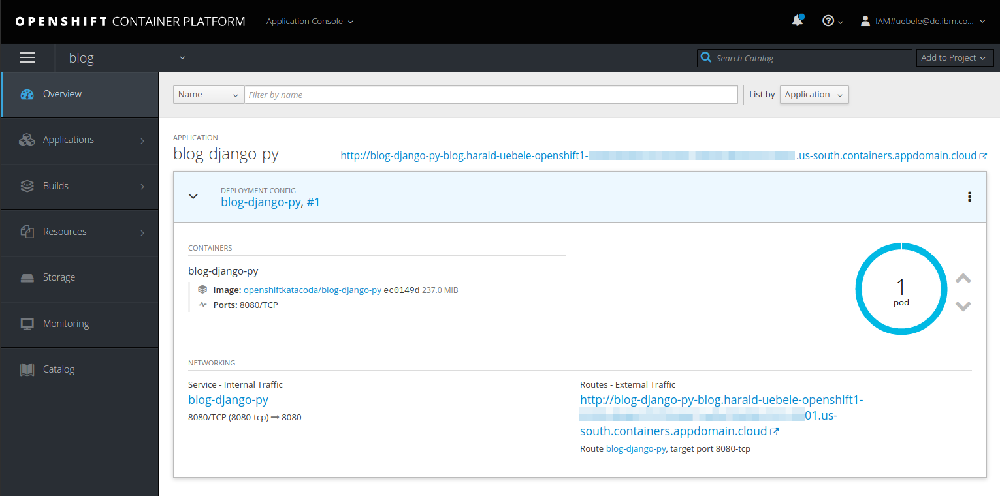
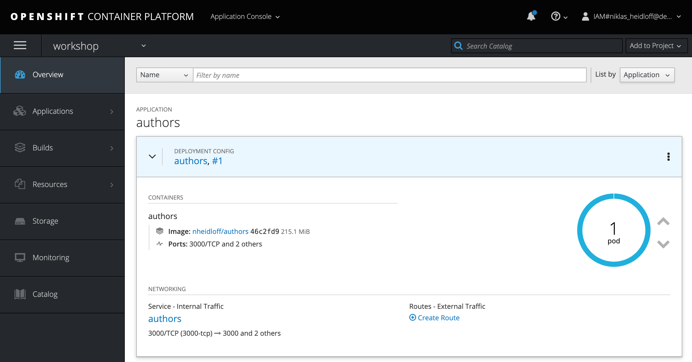

[See this in English](./README.md)

# OpenShift on IBM Cloud ワークショップ

[IBM Cloud上のRed Hat OpenShift](https://cloud.ibm.com/docs/openshift?topic=openshift-why_openshift) は、IBMがOpenShift Container Platformを管理するIBM Cloud Kubernetes Serviceの拡張機能です。

IBM Cloud上のRed Hat OpenShiftを使用すると、開発者はエンタープライズワークロードをKubernetesクラスターにコンテナ化してデプロイするための高速かつ安全な方法を使用できます。 OpenShiftクラスターはKubernetesコンテナーオーケストレーション上に構築され、開発ライフサイクル操作に一貫性と柔軟性を提供します。

このリポジトリには、開発者としてRed Hat OpenShift、IBM Cloudへのデプロイ方法、およびOpenShiftでのアプリケーションのデプロイ方法を理解するのに役立つ一連のワークショップがあります。

これらのワークショップを実行するには、[IBM Cloudアカウント](https://cloud.ibm.com/registration) が必要です。

## ワークショップ 1: [OpenShiftを理解する](1-understanding-openshift/README-ja.md#understanding-openshift)

このワークショップでは、IBM Cloud上に独自のOpenShiftクラスターを作成する方法、 `oc` CLI（コマンドラインインターフェイス）を使用する方法、およびOpenShift Webコンソールを使用してアプリケーションをデプロイする方法を解説します。

* 所要時間: 60分 - 90分
* 対象者: 初級者

<kbd></kbd>

**Labs**

0. 概要: [ビデオ (3:42 mins)](https://youtu.be/cotKSI-S1Ng)
1. はじめに: [ビデオ (2:04 mins)](https://www.youtube.com/watch?v=hdwDMsDF9J8) and [ビデオ (5:45 mins)](https://www.youtube.com/watch?v=l4Vrj7mkxhQ)
2. OpenShiftクラスタをIBM Cloud上に作成: [lab](1-understanding-openshift/Part2.md) and [動画 (3:17 mins)](https://youtu.be/9xgqDP2B3WI)
3. OpenShiftでの開発を始めてみる: [lab](https://learn.openshift.com/introduction/getting-started/) and [動画 (12:38 mins)](https://www.youtube.com/watch?v=boJOI0DgSTc&list=PL0Mrq9ES4ERfGpB0K5PHYmvl2xV60GSQz&index=4&t=0s)
4. イメージファイルからアプリをデプロイする: [lab](https://learn.openshift.com/introduction/deploying-images/) and [動画 (9:00 mins)](https://www.youtube.com/watch?v=v_j3TiurPQc&list=PL0Mrq9ES4ERfGpB0K5PHYmvl2xV60GSQz&index=5&t=0s)
5. ソースコードからアプリをデプロイする: [lab](https://learn.openshift.com/introduction/deploying-python/) and [動画 (10:28 mins)](https://www.youtube.com/watch?v=2CtThlhgOYs&list=PL0Mrq9ES4ERfGpB0K5PHYmvl2xV60GSQz&index=6&t=0s)
6. IBM Cloud上のOpenShiftにアプリをデプロイする: [lab](1-understanding-openshift/Part4.md) and [動画 (14:20 mins)](https://www.youtube.com/watch?v=7XBbuPjsUqU&list=PL0Mrq9ES4ERfGpB0K5PHYmvl2xV60GSQz&index=7&t=0s)

---

## ワークショップ 2: [IBM Cloud上のOpenShiftへのJavaマイクロサービスのデプロイ](./2-deploying-to-openshift#deploying-java-microservices-to-openshift-on-ibm-cloud)

このワークショップでは、Javaを使用してマイクロサービスを構築する方法と、IBMクラウドのOpenShiftにデプロイする方法を解説します。

マイクロサービスは可能な限りシンプルに構成されるため、他のマイクロサービスの開始点として使用できます。 このマイクロサービスは、Java EEおよびEclipse MicroProfileを使用して実装されました。

* 所要時間: 60分 - 90分
* 対象者: 中級者

<kbd></kbd>

**Labs**

0. 概要: [ビデオ (1:41 mins)](https://youtu.be/8361HGR_O_s)
1. 前提条件: [lab](2-deploying-to-openshift/documentation/1-prereqs.md) and [動画 (2:58 mins)](https://youtu.be/c5CtqijWXL4)
2. Javaマイクロサービスをローカルで実行する: [lab](2-deploying-to-openshift/documentation/2-docker.md) and [video (3:51 mins)](https://youtu.be/4dT2jg6wGF4)
3. Javaの実装を理解する: [lab](2-deploying-to-openshift/documentation/3-java.md) and [video (9:09 mins)](https://www.youtube.com/watch?v=ugpYSPV9jAs)
4. 'oc' CLIからOpenShiftへのデプロイ: [lab](2-deploying-to-openshift/documentation/4-openshift.md) and [video (14:32 mins)](https://youtu.be/4MDfalo2Fg0)
5. 既存のイメージをOpenShiftにデプロイする: [lab](2-deploying-to-openshift/documentation/5-existing-image.md) and [video (7:09 mins)](https://youtu.be/JhxsS7l6DhA)
6. GitHubリポジトリでのコードの展開: [lab](2-deploying-to-openshift/documentation/6-github.md) and [video (3:52 mins)](https://youtu.be/b3upMuZOpsY)
7. ソースコードからイメージへの展開: [lab](2-deploying-to-openshift/documentation/7-source-to-image.md) and [video (7:06 mins)](https://youtu.be/p6lVc6MDrcM)

---

## リソースと次のステップ

* Red Hat OpenShiftには多くの優れたチュートリアルがあります。 [Interactive Learning Portal](https://learn.openshift.com/)

* IBM Developer Webサイトには [Red Hat OpenShift on IBM Cloud](https://developer.ibm.com/components/redhat-openshift-ibm-cloud/) のセクションがあります。

* GitHub上の我々の [Cloud Native Starter](https://github.com/IBM/cloud-native-starter) プロジェクトには [OpenShiftへのデプロイ方法](https://github.com/IBM/cloud-native-starter/blob/master/documentation/OpenShiftIKSDeployment.md#deploy-cloud-native-starter-on-openshift-on-ibm-cloud) のセクションがあります。

* IBM Cloudソリューションチュートリアル: [Scalable web application on OpenShift](https://cloud.ibm.com/docs/tutorials?topic=solution-tutorials-scalable-webapp-openshift) をチェックしましょう。

