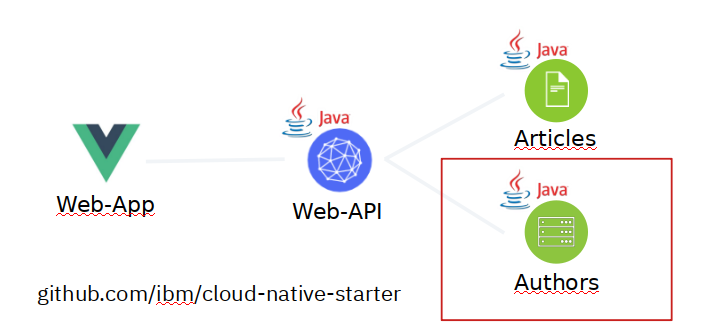
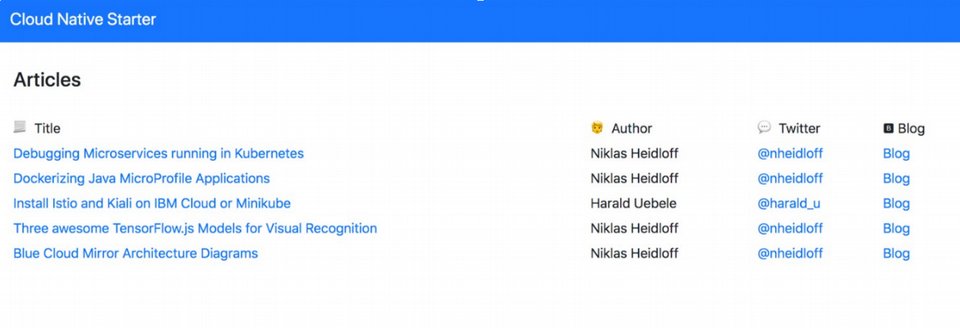

[Red Hat OpenShift on IBM Cloud](https://cloud.ibm.com/docs/openshift?topic=openshift-why_openshift) is an extension of the IBM Cloud Kubernetes Service where IBM manages the OpenShift Container Platform for you. 

With Red Hat OpenShift on IBM Cloud developers have a fast and secure way to containerize and deploy enterprise workloads in Kubernetes clusters. OpenShift clusters build on Kubernetes container orchestration that offers consistency and flexibility for your development lifecycle operations.

This workshop covers **Red Hat OpenShift Version 4.3** which is currently in Beta.

If you are looking for the **OpenShift 3.11 version** of this workshop: It is a branch/release in this repository and you can still find it here: [https://github.com/IBM/openshift-on-ibm-cloud-workshops/tree/OpenShift3.11](https://github.com/IBM/openshift-on-ibm-cloud-workshops/tree/OpenShift3.11)

# Deploying Java Microservices to OpenShift on IBM Cloud

Note: In order to run this workshop, you need an [IBM Cloud account](https://cloud.ibm.com/registration). And you need to gain access to a pre-configured OpenShift Cluster on IBM Cloud, your lab instructor will provide information.

This workshop demonstrates how to build a microservice with Java and how to deploy it to OpenShift on the IBM Cloud.

The microservice is kept as simple as possible so that it can be used as a starting point for other microservices. The microservice has been developed with Jakarta EE and [Eclipse MicroProfile](https://microprofile.io/). It is part of our [Cloud Native Starter](https://github.com/IBM/cloud-native-starter) project which basically consists of 3 microservices:

The web application Web-App (frontend) requests data from Web-API. Web-API retreives a list of articles (title and authors name) from the Articles service, and for every author it retrieves details (Blog URL and Twitter handle) from the Authors service. In this lab we only use the Authors service.

This would be the frontend:

There are [various ways to deploy applications to OpenShift](http://heidloff.net/article/deploying-open-liberty-microservices-openshift/). The options have different advantages and disadvantages which are explained in the following labs.

## Labs

This workshop has 7 labs and should take around 90 minutues to complete. 

The first lab describes how to install all required prerequisites. In the easiest case this means accessing the IBM Cloud Shell.

<**OPTIONAL**>
Lab 2 and 3 describe how to develop a microservice with Java EE and Eclipse MicroProfile and are useful if you are interested in coding.
<**/OPTIONAL**>

The next four labs show four different ways to deploy applications to OpenShift with their pros and cons in this specific scenario:

| Option | Dockerfile | yaml Files | Java Build | Docker Build |
| - | - | - | - | - |
| Lab 4: Kubernetes-like | required | required | OpenShift | OpenShift |
| Lab 6: Existing Image  | not required  | not required | N/A | N/A |
| Lab 7: Git Repo | required  | not required | OpenShift | OpenShift |
| Lab 8: Source to Image | not required | not required | Desktop | OpenShift |

---

To continue with the workshop follow these steps:

1. **>> [Prerequisites](1-prereqs.md) <<**
1. [OPTIONAL: Running the Java microservice locally](2-docker.md)
1. [OPTIONAL: Understanding the Java implementation](3-java.md)
1. [Deploying to OpenShift via 'oc' CLI](4-openshift.md)
1. [Distributed logging with LogDNA and OpenShift on IBM Cloud](5-logdna-openshift.md)
1. [Deploying existing images to OpenShift](6-existing-image.md)
1. [Deployments of code in GitHub repos](7-github.md)
1. [Source to Image deployments](8-source-to-image.md)

