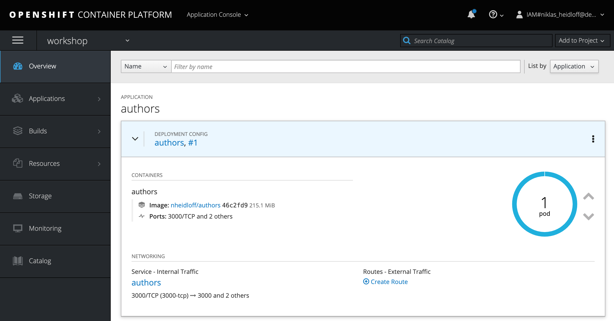

# OpenShift on IBM Cloud Workshops

[Red Hat OpenShift on IBM Cloud](https://cloud.ibm.com/docs/openshift?topic=openshift-why_openshift) is an extension of the IBM Cloud Kubernetes Service, where IBM manages OpenShift Container Platform for you. 

With Red Hat OpenShift on IBM Cloud developers have a fast and secure way to containerize and deploy enterprise workloads in Kubernetes clusters. OpenShift clusters build on Kubernetes container orchestration that offers consistency and flexibility for your development lifecycle operations.

This repository holds a series of workshops that help you as a developer to become familiar with Red Hat OpenShift, how it can be deployed on the IBM Cloud, and how to deploy applications on and with OpenShift.

In order to run these workshops, you need an [IBM Cloud account](https://cloud.ibm.com/registration).

## Workshop 1: [Understanding OpenShift](1-understanding-openshift/README.md#understanding-openshift)

In this workshop we will show you how to create your own OpenShift cluster on the IBM Cloud, and how to use the 'oc' CLI (command line interface) and the OpenShift Web Console to deploy applications.

* Duration: 60 - 90 minutes
* Audience: Beginner

<kbd></kbd>

## Workshop 2: [Deploying Java Microservices to OpenShift on IBM Cloud](https://github.com/nheidloff/openshift-on-ibm-cloud-workshops/tree/master/2-deploying-to-openshift#deploying-java-microservices-to-openshift-on-ibm-cloud)

This workshop demonstrates how to build a microservice with Java and how to deploy it to OpenShift on the IBM Cloud.

The microservice is kept as simple as possible, so that it can be used as a starting point for other microservices. The microservice has been developed with Java EE and Eclipse MicroProfile.

* Duration: 60 - 90 minutes
* Audience: Intermediate

<kbd></kbd>

## Resources and next Steps

* There are many good tutorials on the Red Hat OpenShift [Interactive Learning Portal](https://learn.openshift.com/).

* The IBM Developer Website has its own section on [Red Hat OpenShift on IBM Cloud](https://developer.ibm.com/components/redhat-openshift-ibm-cloud/).

* Our [Cloud Native Starter](https://github.com/IBM/cloud-native-starter) project on GitHub has a section on [how to deploy on OpenShift](https://github.com/IBM/cloud-native-starter/blob/master/documentation/OpenShiftIKSDeployment.md#deploy-cloud-native-starter-on-openshift-on-ibm-cloud).

* Check this IBM Cloud solution tutorial: [Scalable web application on OpenShift](https://cloud.ibm.com/docs/tutorials?topic=solution-tutorials-scalable-webapp-openshift).

